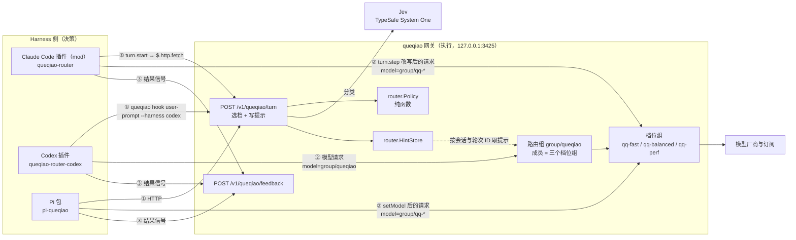
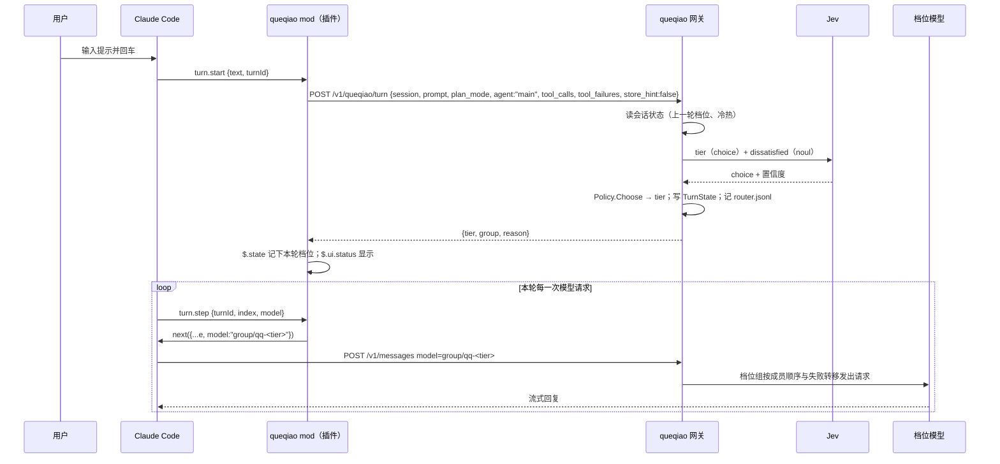

# 鹊桥（queqiao）总体设计：Agent Harness 模型路由器

- 日期：2026-10-02（2026-10-03 修订：增加 Codex harness 支持；增加 fork 子代理与派生会话的档位继承；确定仓库与分支策略。同日二次修订：Claude Code 集成由命令型 hook 加网关提示改为 Claude Code mods，由 mod 在 `turn.step` 逐请求改写模型，见第 2、3.1、5.5、6.7 节。写 SP1 计划时三次修订：Provider 名不改、配置目录改由 `appdir.SetName` 决定，依据见第 6.1 节。SP0-spike 完成后修订：按 `docs/superpowers/notes/spike-results.md` 的 S1–S13 结论，应用 S5、S8、S12、S13 的备选方案，并记录 S3、S7、S11 的实测差异）
- 状态：待审批（审批后按第 11 节交给 `superpowers:writing-plans`）
- 仓库：[weiping/queqiao](https://github.com/weiping/queqiao)，fork 自 [yetone/magpie](https://github.com/yetone/magpie)，MIT 协议
- 分支：`main` 只与上游同步；queqiao 的全部开发在 `queqiao` 分支上进行（第 6.1 节）。本规格以 `main` 的 commit `49ee7d8`（2026-10-03）为基线，规格中引用的上游代码均已在该 commit 上核对
- 对标：LangChain《How to Build a Model Router in the Harness》（事前选档）与 OpenRouter《Confidence Thresholds for Model Escalation Routing》（事后复核）
- 记号：`<p>` 指提供某模型的 Provider ID
- 术语：**仓库 fork** 指 queqiao 从 magpie 分叉出来这件事（第 6.1 节）；**fork 子代理**指继承父会话全部上下文的子代理；**派生会话**指把一段对话复制成一个新会话（Claude Code 的 `/fork`、`/branch`，Codex 的线程分叉，Pi 的 `/fork`、`/tree` 分支）。后两者见第 5.8 节

---

## 1. 目标、成功标准与非目标

### 1.1 目标

queqiao 是一个**放在 Agent Harness 里做决策、在本地网关里执行**的模型路由器，服务 Claude Code、Codex 和 Pi 三个 Agent，分别以 Claude Code 插件（mod 形式）、Codex 插件和 Pi 包的形式提供。

| 编号 | 目标 |
| --- | --- |
| G1 | 每个用户轮次开始、模型请求发出之前，选定这一轮的**档位**（`fast` / `balanced` / `performance`）。依据是 harness 才拿得到的上下文：用户原话、计划模式、Agent 类型、项目级判定标准 |
| G2 | 子代理单独选档：从零开始的子代理在派生时单独选档（Claude Code、Codex，以及 Pi 上的 pi-subagents 扩展）；继承父会话上下文的 fork 子代理跟随父会话当前的档位；派生会话的第一轮继承父会话的档位状态（第 5.8 节） |
| G3 | 事后复核（附件“开关二”的 Agent 版）：上一轮的结果信号表明这一档不够时，下一轮自动升档 |
| G4 | 档位与具体模型解耦。换模型只改配置，不改代码，不重装插件 |
| G5 | 失败安全：路由链路的任何一环失败，请求都照常完成；选档（hook 或 mod 等待 `/turn`）带来的额外延迟每轮不超过 1.5 秒 |
| G6 | 内置线上 A/B 验收，能回答“省了多少钱、质量退了没有” |

### 1.2 成功标准

和固定使用 `performance` 档相比，路由组满足以下三条（数据来自第 9 节的实验）：

1. 每会话成本中位数下降 ≥ 40%（附件中 Open SWE 为 64%）。
2. “以合并 PR 结束的会话占比”差异在统计上不显著（双比例 z 检验，p ≥ 0.05）。
3. 用户手动换模型的会话占比不高于对照组。

另做一组“固定 `fast` 档”的对照，确认路由组质量明显好于全用最便宜档位。附件的结论来自这两组对照放在一起看。

### 1.3 非目标（YAGNI）

| 不做 | 原因 |
| --- | --- |
| 单次调用的“便宜模型自报置信度 → 低于阈值换强模型重答”（OpenRouter 原样） | 编码 Agent 的一轮要跑几十次模型调用，单次调用的答案没法独立打分；Claude Code 后台的小调用（标题、摘要）不值得升级。G3 用“轮次级升档”覆盖同一需求 |
| 离线评测基准（如 DeepSWE） | 附件也只列为后续计划；v1 只做线上 A/B |
| 自训分类器 | 用 TypeSafe Jev，备选为任意小模型 |
| OpenCode、Gemini CLI 等其他 Agent 的插件 | 它们仍可通过网关模式使用路由组（第 5.7 节），但没有 harness 上下文 |
| 修改 magpie 的桌面界面 | 路由状态通过 CLI、Claude Code mod 的状态栏条目和现有的 `/v1/magpie/route` 查看 |
| 多用户服务端部署 | 定位是本机网关；局域网共享沿用 magpie 现有的网关密钥机制 |
| 自动更新 | v1 关闭（第 6.1 节）。fork 不能沿用上游的更新通道 |

---

## 2. 背景与约束（设计依据）

以下事实决定了架构，均已查证（来源见第 13 节）。

**Claude Code**
- **mods（v2.1.287 起）**：插件的 `hooks/hooks.json` 可以写 `{"modules": ["./register.ts"]}`，指向一个 TypeScript 模块，导出 `register(on, options)`。每个 hook 的签名是 `($, e, next)`：`next(e)` 交给下层和 Claude Code 自身，`next({...e, x})` 改写下层看到的输入，不调 `next` 就由 hook 自己作答。模块运行在独立环境里，没有 Node 和 DOM，对外只能通过 `$`。与 queqiao 有关的事件和接口：
  - `turn.start`：输入 `{text, turnId}`，`text` 是 `prompt.submit` 和设置里的 `UserPromptSubmit` hook 处理之后的用户原话，`turnId` 由这里生成，同一轮的每个 `turn.step` 和 `turn.complete` 都带同一个值。
  - `turn.step`：**每一次模型请求发出前**触发，输入 `{turnId, index, model, effort?, messageCount, agentId?}`；主会话的请求没有 `agentId`，子代理的请求带子代理的 `agentId`。hook 用 `next({...e, model})` 改这一次请求的模型，`effort` 同样可改，其余字段不可改。`model` 是 Claude Code 为这一步解析出的模型（会话模型或回退模型），不是上一个 hook 改写后的值。这是流式事件，hook 写成异步生成器（`yield* next(e)`）。
  - `agent.spawn`：派生子代理时触发，输入含 `prompt`、`description`、`subagentType`、`model?`、`parentModel`、`fork`、`background`、`parentAgentId?`；hook 改写 `model`（别名或完整模型 ID）为子代理选模型，`next(e)` 返回 `{model, agentId}`。`fork` 为 true 时 `model` 被忽略，fork 永远继承父代理的模型。
  - `tool.call`：`await next(e)` 得到工具结果，带 `isError` 和模型看到的文本 `text`；子代理里的调用带 `agentId`。hook 可用 `on(event, { tool: 'Bash' }, handler)` 形式按工具名过滤。\n  - **状态**：`$.state` 推荐用 `atom`/`read`/`update`（从 `claude-code` 包导入）带类型地读写；状态类型在插件的 `types/index.d.ts` 里声明、经 plugin.json 的 `types` 字段关联，否则 `claude plugin validate` 报错。渲染 hook 对 `read` 自动订阅，`update` 后自动重画。\n  - **治理**：Team/Enterprise 机器上内置 `sec-default` mod 最先加载，限制用户 mod 的风险操作；`prependPlugins`/`appendPlugins` 由管理员固定 mod 顺序（自定义时须把 `sec-default` 写进列表）；`--safe-mode` 在单会话关闭已安装 mod——这是「mod 没有加载」的一种场景（第 7 节）。第三方 mod 先用 `claude plugin validate` 静态审查它挂了哪些事件、调了哪些 API。
  - `turn.complete`：一轮结束，带用量；子代理跑完时带它的 `agentId`。
  - `classic.<事件名>`：设置型 hook 的全部事件也能在 mod 里订阅，包括 `classic.SessionStart`（`source` 取值 `startup`、`resume`、`clear`、`compact`、`fork`）和 `classic.PostModelSwitch`（`from_model`、`to_model`、`source` 取值 `command`、`picker`、`sdk`、`auto`、`resume`）。
  - `$.http.fetch(url, init)`：经 Claude Code 主机发 HTTP 请求，组织的网络访问策略可以拒绝；`init` 没有超时参数。`$.session.id()` 取会话 ID；`$.store` 是跨会话的键值存储，`$.state` 是本会话的状态；`$.ui.status(text)` 在状态栏显示一段文字；`$.model.classify(text, labels)` 用模型做分类。
  - 单个 hook 自身运行有 10 秒上限。工具链：`claude plugin validate` 校验模块会调用什么、会被拒什么；`claude plugin test` 运行插件里的 `*.test.ts`。
  - 托管设置 `allowManagedModsOnly` 只允许组织下发的 mod，`disableAllHooks` 关闭全部 hook（含 mod）。这两种情况和低于 v2.1.287 的 Claude Code 一样，mod 不加载。
- **命令型 hook 换不了模型**：设置里或插件 `hooks.json` 里的命令型 hook，没有一个能更换主会话的模型；`PreModelSwitch` 只能拦截用户发起的切换，`UserPromptSubmit` 改不了提示本身。queqiao 的上一版设计因此只能把档位作为“提示”放进网关，再由网关按提示哈希去对；mod 的 `turn.step` 让这一层绕路不再必要。
- 子代理的模型解析顺序中，单次调用的 `model` 参数优先级最高，可选值为 `sonnet`、`opus`、`haiku`、`fable`、完整模型 ID 或 `inherit`。
- fork 子代理：由 `/subtask` 或 Claude 调用 `Agent` 工具时指定 `subagent_type: "fork"` 创建，继承主会话的全部对话、系统提示和工具，**模型与主会话相同**，第一次请求复用主会话的 prompt cache。交互模式下 fork 模式默认开启（v2.1.232 起），`CLAUDE_CODE_FORK_SUBAGENT=0` 关闭。`agent.spawn` 对 fork 忽略 `model`，但 fork 的每次请求仍会经过 `turn.step`，带着它自己的 `agentId`。
- 派生会话：`/fork` 把对话复制成一个新的后台会话（v2.1.212 起；v2.1.161–v2.1.211 的 `/fork` 即现在的 `/subtask`）；`/branch` 在当前位置建一个分支并切换进去。`SessionStart` 的 `source` 取值包括 `fork`，输入里没有父会话 ID。
- 插件结构：`.claude-plugin/plugin.json`、`hooks/hooks.json`、`agents/`；`plugin.json` 的 `userConfig` 定义用户可填的配置项。插件子代理支持 `model` 字段，但不支持 `hooks`、`mcpServers`、`permissionMode`。

**Pi**
- 扩展可调用 `pi.setModel()` 和 `pi.setThinkingLevel()`。
- 可订阅 `before_agent_start`（拿到 `prompt` 与 `systemPrompt`）、`before_provider_headers`（改请求头）、`before_provider_request`（替换请求体）、`model_select`（含 `source`）、`tool_result`、`session_start` 等事件。
- 包通过 `package.json` 的 `pi.extensions` 声明，`.ts` 直接加载，用 `pi install npm:<pkg>` 安装；运行时依赖放在 `dependencies` 里。
- `tool_call` 事件的 `event.input` 可以直接修改，用来改写任意工具的参数。`session_start` 的 `reason` 取值包括 `fork`。
- 会话分支：`/fork`、`/tree` 生成新的会话文件；会话可以记录父会话（`newSession({ parentSession })`）；模型以 `ModelChangeEntry` 记在会话里。
- Pi 核心没有子代理。常用的第三方扩展 [tintinweb/pi-subagents](https://github.com/tintinweb/pi-subagents) 在同一进程内运行子代理，提供 `Agent` 工具，调用时可传 `model`、`thinking`，以及 `inherit_context`（把父对话放进子代理上下文）。

**Codex**
- 和 Claude Code 的命令型 hook 一样，Codex 的 hook 换不了主会话的模型。hook 输出能做的是拦截、补充上下文（`additionalContext`）、审批决定，以及在 `PreToolUse` 里用 `updatedInput` 改写工具参数。
- 所有 hook 的输入都有 `session_id`、`transcript_path`、`cwd`、`hook_event_name`、`model`、`permission_mode`；轮次内的 hook 另有 `turn_id`。`UserPromptSubmit` 另有 `prompt`。
- `PreToolUse` 可以匹配本地函数工具，`spawn_agent` 的匹配别名为 `Agent`，`updatedInput` 对本地函数工具有效。
- 子代理：`spawn_agent` 的工具说明只列出 `message`、`items`、`fork_context`，但运行时接受并执行 `model` 和 `reasoning_effort`（openai/codex#26948，Codex 0.137.0，issue 仍开放）。`fork_context: true` 时把父线程的完整历史复制给子代理（openai/codex#14981），此时传入的 `model` 同样会生效，只是子会话里显示的仍是父代理的模型（openai/codex#16371）。内置子代理角色为 `default`、`worker`、`explorer`；自定义子代理放在 `~/.codex/agents/*.toml`，可以写 `model` 与 `model_reasoning_effort`。
- 插件：根目录放可移植的 `plugin.json`，`skills/`、`mcp.json`、`hooks/hooks.json` 放在插件根目录下；`.codex-plugin/plugin.json` 只是兼容旧版。hook 命令里可用 `PLUGIN_ROOT`、`PLUGIN_DATA`（另有 `CLAUDE_PLUGIN_ROOT`、`CLAUDE_PLUGIN_DATA` 兼容别名）。仓库级插件市场文件为 `.agents/plugins/marketplace.json`，旧版也读 `.claude-plugin/marketplace.json`；安装命令为 `codex plugin marketplace add <owner>/<repo>`。
- 插件自带的 hook 和其他非托管 hook 一样，首次运行前要用户审核并信任（`/hooks`），信任按 hook 内容的哈希记录。hook 功能默认开启，`[features] hooks = false` 可关闭。
- 历史风险：Codex 0.118.0 时有报告称插件自带的 hook 不会执行（openai/codex#16430）。当前官方文档已写明插件可以自带 hook，实际行为在 S7 中验证。
- Codex 把每轮的元数据放在 Responses 请求体的 `client_metadata["x-codex-turn-metadata"]` 中，同时投影到同名请求头，字段包括 `session_id`、`thread_id`、`turn_id`（openai/codex#27122）。magpie 已经会读这份元数据里的线程来源与父线程字段（`session_parent.go`），会话 ID 从 `session_id` 请求头读取。
- Codex 只在启动时读模型目录，改了 `model_catalog_json` 要重启 Codex。
- 线程分叉生成新线程，每轮元数据里带 `forked_from_thread_id`；子代理线程的元数据里带 `parent_thread_id`。magpie 的 `session_parent.go` 已经能解析这两个字段。

**magpie（上游）**
- 路由组 `group/<id>`：成员可嵌套其他组（最多 8 层），成员可固定推理强度（`provider/model:<effort>`）；有 `routing`、`stays`、`effort=auto` 和分类器设置。
- 规则引擎在每个用户轮次开始时决定一次，同一轮内的工具往返都留在原模型上，子代理的请求单独算轮次。上下文涨到窗口的 95% 时会换到窗口更大的成员。
- 网关会话 ID 依次取自 `X-Magpie-Session`、`x-claude-code-session-id`、`x-session-id` 等请求头（`gateway.go` 中的 `sessionOf()`）。
- 已经实现了 TypeSafe System One 的调用和结果解析（`decide.go` 的 `jevBody()`、`readJev()`），intent 的置信度门槛为 0.4。
- 中间表示 `Part` 带有 `IsError` 字段，网关能从下一次请求里看出上一轮哪些工具调用失败了。

**Jev（TypeSafe System One）**
- 接口为 `POST https://api.typesafe.ai/v1/systemone`，题型有 `choice`（最多 255 个选项）、`score`（2–10 级）、`noul`（0–1），返回概率和置信度。
- 价格：输入每百万 token 0.042 美元，输出不收费。单次请求上限 64k token，其中 state 加最长的一道题不超过 32k。限流为每秒 40 次请求、10 万 token。
- 官方测试中 13 个问题合在一次调用里用时 0.27 秒（jev-1.12）。
- 弱点：数数和数值比较不可靠，无关上下文会干扰判断，不防提示注入。
- 零数据保留只对企业客户提供。

---

## 3. 总体架构



**分工**

- **harness 侧**提供网关拿不到的东西：用户原话（不含系统附加内容）、计划模式、Agent 和子代理类型、项目级判定标准，以及手动换模型、PR 结果这类结果信号。
- **网关侧**提供 harness 拿不到的东西：同一会话里所有请求的历史（上一轮档位、工具失败次数、距上次请求的时间）、厂商与账号的失败转移，以及用量和成本记账。Claude Code 的 mod 能直接看到工具结果的 `isError`，所以会把上一轮的工具调用数和失败数随 `/turn` 一起报上来，网关优先用它（第 6.4 节）。

### 3.1 一轮对话的数据流（Claude Code）



Claude Code 的请求直接进入档位组，不经过路由组，也不需要提示存储：档位在 mod 里就绑定到了每一次请求上，同一轮的工具往返自然留在同一档。

Codex 的流程仍是“hook 写提示、网关取提示”：hook 把 `turn_id` 一起发给 `/turn`（`store_hint:true`）；Codex 的请求带 `model=group/queqiao`，网关从请求的 `x-codex-turn-metadata` 里读出同一个 `turn_id`，按 `(会话, turn_id)` 精确取提示，再把对应档位组排到路由组成员的第一位（第 6.5 节）。Codex 走 OpenAI Responses 协议。

Pi 的流程与 Claude Code 相似，第 ① 步由 `before_agent_start` 发起，`store_hint:false`。扩展拿到档位后调用 `pi.setModel()`，所以 Pi 的请求同样直接进入档位组。

---

## 4. 模型配置策略

### 4.1 档位定义

档位是路由器唯一的决策输出。每一档等于“一个模型加一个固定的推理强度”，外加同档的失败转移成员。

| 档位 | 接什么活 | Jev 判定标准（默认值，写入 `router.json`） |
| --- | --- | --- |
| `fast` | 提问、解释、查日志、跑命令、一行或机械式改动、只读的代码搜索 | `Little work: a question, an explanation, reading logs, running a command, a one-line or mechanical change, a read-only code search` |
| `balanced` | 已知代码里的普通 bug 修复、小功能、补测试、单文件重构 | `Some work: an ordinary bug fix or a small feature in code already understood, adding tests, a single-file refactor` |
| `performance` | 跨多文件改动、原因未知的 bug、并发 / 性能 / 安全问题、架构与方案设计、长计划 | `Much work: a change across several files, a bug whose cause is unknown, concurrency, performance or security issues, an architecture or design decision, a long multi-step plan` |

默认判定标准改编自 magpie `decide.go` 中的 `levelWork`。项目可以在仓库里放 `.queqiao/router.json` 覆盖这三条标准，写进本项目的领域知识，例如“改动 `migrations/` 下的文件一律算 performance”。这对应 Open SWE 用自家任务分布写出的分档标准。

### 4.2 选型原则

1. **沿成本—能力的帕累托前沿取三个点**（参照 Artificial Analysis Intelligence Index），相邻两档的单任务成本最好拉开 3 倍以上，这样路由才有省钱空间。附件的三档之间差了约 30 倍。
2. **推理强度属于档位的一部分**，用成员后缀固定，例如 `glm/glm-5.3-flash:xhigh`。便宜模型配高推理强度、贵模型配低推理强度，常常比反过来更划算，附件里的快速档就是这样配的。
3. **跨厂商**：三档尽量来自不同厂商，档内的失败转移成员也要来自另一家厂商，避免单家故障或限流时整档不可用。
4. **硬性门槛**（入选前用第 4.6 节的冒烟测试验证）：
   - 工具调用稳定：连续 20 次带工具的请求中，参数解析失败 ≤ 1 次。
   - 上下文窗口：`fast` ≥ 128k，`balanced` ≥ 200k，`performance` ≥ 另外两档的最大值，保证 95% 换窗口的规则只会往上换。
   - 能通过 queqiao 的协议翻译，在 Anthropic Messages 和 OpenAI Responses 两种协议下都正常工作（Claude Code 走前者，Codex 走后者，Pi 视 Provider 配置而定）。
5. **失败转移不降级**：档内成员的能力必须与本档相当或更高。整档失败时先升一档；`performance` 档整档失败才落到 `balanced`。宁可多花钱，也不悄悄把质量降下去。
6. **价格必须真实**：中转站要用 `queqiao model price` 填实际单价，否则成本统计会按官方定价算，A/B 的结论会失真。
7. **订阅只作补充**：Claude、ChatGPT 等订阅共享可能违反厂商条款。实验期间三档的主成员只用 API Key 类 Provider，订阅只能当失败转移成员。

### 4.3 预设方案

`queqiao router init --preset <名字>` 生成第 4.4 节的组配置。下表的模型 ID 以 `queqiao models` 的实际输出为准，`<p>` 表示提供该模型的 Provider ID。这些预设只是起点，第 9 节的实验数据才是调档的依据。

**预设 `frontier`（与附件相同，跨厂商）**

| 档位 | 主成员 | 同档失败转移 |
| --- | --- | --- |
| fast | `<p>/glm-5.3-flash:xhigh` | `deepseek/deepseek-v4-flash` |
| balanced | `<p>/gpt-5.6-sol:medium` | `<p>/claude-sonnet-5:medium` |
| performance | `<p>/gpt-6-astra:low` | `<p>/claude-opus-5-5:high` |

**预设 `anthropic`（只用 Claude 系，适合只有 Anthropic Key 的用户）**

| 档位 | 主成员 | 同档失败转移 |
| --- | --- | --- |
| fast | `anthropic/claude-haiku-4-5` | `openrouter/anthropic/claude-haiku-4-5` |
| balanced | `anthropic/claude-sonnet-5:medium` | `openrouter/anthropic/claude-sonnet-5:medium` |
| performance | `anthropic/claude-opus-5-5:high` | `openrouter/anthropic/claude-opus-5.5:high` |

**预设 `cn`（国内厂商优先）**

| 档位 | 主成员 | 同档失败转移 |
| --- | --- | --- |
| fast | `deepseek/deepseek-v4-flash` | `glm/glm-5.3-flash:high` |
| balanced | `moonshot/kimi-k2.5` | `glm/glm-5.3:high` |
| performance | 沿用 `frontier` 的 performance 主成员 | 沿用 `frontier` 的 performance 失败转移 |

`cn` 预设的 performance 档暂不指定国内模型。初始化时 CLI 会提示用户从 `queqiao models` 里挑一个当前公认最强的国内模型替换，或者保持沿用 `frontier`。

### 4.4 落到网关配置

预设展开成 4 个路由组，都写入 `~/.config/queqiao/providers.json`。`init` 实际执行的等价命令如下。

```sh
queqiao group add qq-fast        models=<fast 主>,<fast 备>               routing=order stays=auto
queqiao group add qq-balanced    models=<balanced 主>,<balanced 备>       routing=order stays=auto
queqiao group add qq-perf        models=<perf 主>,<perf 备>               routing=order stays=auto
queqiao group add queqiao        models=group/qq-balanced,group/qq-perf,group/qq-fast routing=order stays=turn
```

- `queqiao` 是路由组。成员顺序决定没有提示、也没有分类结果时的默认档（`balanced`），以及整档失败后的转移方向：选中档排第一，其余按 balanced、perf、fast 的顺序，`fast` 永远排在最后。
- 路由组的 `stays=turn`：每轮重新决定档位，同一轮之内保持不变。
- 档位组的 `stays=auto`：沿用 magpie 的默认行为，缓存还热就留在同一账号上。

### 4.5 Agent 侧的模型映射

| Agent | 设置 | 值 |
| --- | --- | --- |
| Claude Code | 主模型 `model` | `group/queqiao`。mod 在 `turn.step` 里把每次请求改成 `group/qq-<档位>`；mod 没加载或 `/turn` 失败时，请求仍以 `group/queqiao` 发出，由网关模式路由（第 5.7 节） |
| | `ANTHROPIC_DEFAULT_HAIKU_MODEL`、`ANTHROPIC_SMALL_FAST_MODEL` | `group/qq-fast`（也覆盖标题、摘要等后台小调用） |
| | `ANTHROPIC_DEFAULT_SONNET_MODEL` | `group/qq-balanced` |
| | `ANTHROPIC_DEFAULT_OPUS_MODEL`、`ANTHROPIC_DEFAULT_FABLE_MODEL` | `group/qq-perf` |
| | `CLAUDE_CODE_SUBAGENT_MODEL` | 不设置，由 mod 在 `agent.spawn` 时选档 |
| Codex | `model_provider` | `magpie`（沿用 magpie 写的 `[model_providers.magpie]`，`wire_api = "responses"`；不改名的原因见第 6.1 节） |
| | `model` | `group/queqiao` |
| | `model_catalog_json` | 由 `router init` 重写，包含 `group/queqiao` 与三个档位组；写完提示用户重启 Codex |
| | `model_reasoning_effort` | 不改。档位成员用 `:<effort>` 后缀固定推理强度，覆盖 Codex 自己请求的强度 |
| | 子代理 | 不写 `[agents]` 默认模型，由插件在 `spawn_agent` 时选档 |
| Pi | Provider | `magpie`（沿用 magpie 写的 Provider） |
| | 默认模型 | `magpie/group/qq-balanced`，扩展每轮调用 `setModel` 切换 |

这样映射后，用户在 Claude Code 里用 `/model opus` 手动换模型，`turn.step` 收到的 `model` 会变成 `group/qq-perf`，不再是 `group/queqiao`；mod 只改写 `model` 为路由组的请求，于是不再介入，相当于用户手动把档位钉住了。`/model` 选回默认模型，路由就恢复。Codex 同理：`/model` 选了 `group/qq-perf`，请求就不再经过路由组；Codex 的 hook 输入自带当前的 `model`，插件据此识别用户已手动钉住档位（第 6.9 节）。

### 4.6 选型的冒烟测试与例行复审

- `queqiao router check`：对三档主成员和失败转移成员逐个检查第 4.2 节第 4 条的门槛。分别用 Anthropic Messages 和 OpenAI Responses 协议发 20 次带工具的请求，并检查窗口大小是否满足要求。任何一项不过，返回非零退出码。
- 每季度或某一档出现新的帕累托点时复审：新模型先作为同档失败转移成员加入，跑一轮 A/B（第 9 节），数据不劣于现任主成员再提升为主成员。

---

## 5. 路由策略（`router.Policy`）

策略是一个**纯函数**，不做 I/O，所有输入由调用方准备好。这是整个系统里测试最密集的一个单元。

### 5.1 输入与输出

```go
type Tier string // "fast" | "balanced" | "performance"

type PolicyInput struct {
    Agent          string    // "main"、"gateway" 或子代理类型，如 "Explore"、"explorer"
    PlanMode       bool      // harness 报告处于计划模式（Claude Code 为 permission_mode == "plan"；Codex 见 S8）
    Classified     *Verdict  // Jev 结果；nil 表示分类失败或超时
    Prev           *TurnState // 本会话上一轮；nil 表示第一轮
    ToolFailures   int       // 上一轮工具结果中 IsError 的个数（harness 随 /turn 上报的优先，否则用网关统计）
    ToolCalls      int       // 上一轮工具调用总数（来源同上）
    SinceLast      time.Duration // 距本会话上一次模型请求的时间
    Now            time.Time
}

type Verdict struct {
    Tier            Tier
    TierConfidence  float64 // 0–1
    Dissatisfied    float64 // noul 0–1：用户在说上一轮的结果不对
}

type TurnState struct {
    Tier          Tier
    EscalatedLeft int  // 升档剩余的轮数
    LowerStreak   int  // 连续几轮分类结果低于当前档位
}

type Decision struct {
    Tier   Tier
    Reason string     // 见 5.2 的规则编号，如 "R3-escalate"
    Next   TurnState  // 写回会话状态
}

func Choose(in PolicyInput, cfg PolicyConfig) Decision
```

### 5.2 决策规则（按顺序，命中即止）

| 规则 | 条件 | 结果 |
| --- | --- | --- |
| R1 固定子代理 | `Agent` 在 `cfg.FixedAgents` 里（默认：Claude Code 的 `Explore`、`statusline-setup`、`claude-code-guide` 与 Codex 的 `explorer` → `fast`；Claude Code 的 `Plan` → `performance`） | 对应档位 |
| R2 计划模式 | `PlanMode` | `performance` |
| R3 升档 | `Prev != nil`，并且 `Classified.Dissatisfied ≥ cfg.DissatisfiedMin`（默认 0.7）或上一轮 `ToolCalls ≥ 3` 且 `ToolFailures*2 ≥ ToolCalls` | `max(分类档, Prev.Tier + 1)`；分类不可用或不可信时为 `Prev.Tier + 1`。`EscalatedLeft = cfg.EscalateTurns`（默认 2） |
| R4 升档保持 | `Prev.EscalatedLeft > 0` | `max(分类档, Prev.Tier)`，`EscalatedLeft - 1` |
| R5 分类可信 | `Classified != nil` 且 `TierConfidence ≥ cfg.TierMin`（默认 0.4） | 进入 R6 的迟滞判断 |
| R6 迟滞 | 没有上一轮，或 R5 的档位高于或等于上一轮：直接采用，`LowerStreak = 0`。低于上一轮：`SinceLast ≥ cfg.CacheTTL`（默认 300 秒，此时缓存已凉）或 `Prev.LowerStreak + 1 ≥ 2` 时降档并令 `LowerStreak = 0`；否则保持 `Prev.Tier`，`LowerStreak = Prev.LowerStreak + 1` | 见左 |
| R7 沿用 | 分类失败或不可信，且有上一轮 | `Prev.Tier` |
| R8 默认 | 以上都不满足 | `cfg.DefaultTier`（默认 `balanced`） |

说明：
- “档位 + 1”在 `performance` 封顶。
- 只有 R6 允许降档。升档总是立即生效，降档要么等缓存凉了，要么连续两轮都判低。附件提到中途换模型会扔掉 prompt cache，迟滞规则就是为这一点设计的。
- 数值判断（工具失败比例、时间间隔）全部在代码里做，不交给 Jev。Jev 数数和比较数值不可靠。
- 除 R1 外，`Decision.Next` 一律写回会话状态，`EscalatedLeft` 与 `LowerStreak` 在未提到的规则里保持 0。
- **子代理无状态**：`Agent` 既不是 `main` 也不是 `gateway` 时（即子代理），`Prev` 恒为 nil，`Decide` 不读写会话状态。子代理的选档不会影响主会话下一轮的判断。

### 5.3 Jev 的问法

`/v1/queqiao/turn` 发给 Jev 的请求一次带两道题。官方文档说明，多加题目对响应时间影响很小。

```json
{
  "model": "jev-latest",
  "state": {
    "message": "<用户原话，去掉 <system-reminder> 等附加内容，超过 4000 字时保留前 3000 字和后 1000 字>",
    "previous_tier": "balanced",
    "agent": "main"
  },
  "questions": {
    "tier": {
      "type": "choice",
      "instructions": "The `message` is what a user asked a coding assistant. Which tier can most cheaply handle it well? A message that only carries on from the turn before (go on, yes, do it) is of `previous_tier`.",
      "criteria": { "fast": "<4.1 的标准>", "balanced": "<4.1 的标准>", "performance": "<4.1 的标准>" }
    },
    "dissatisfied": {
      "type": "noul",
      "instructions": "The `message` says the assistant's previous result was wrong, broken, incomplete, or not what the user asked for."
    }
  }
}
```

`state` 里刻意不放对话原文、文件列表和数字特征，因为无关内容会干扰 Jev。第一轮没有上一轮档位，`previous_tier` 省略，`tier` 的说明里也去掉“carries on”那一句。

### 5.4 分类器备选

`router.json` 的 `classifier` 字段可以写 `typesafe/jev-latest`（默认），也可以写任意 `provider/model`。用普通模型时，复用 magpie `classify.go` 的“只回答一个编号”的提示词：`tier` 题照常回答，`dissatisfied` 题单独再问一次“yes/no”。普通模型拿不到置信度，此时 `TierConfidence` 按回答格式是否合法记为 1 或 0。**（SP3 实测修订）** `max_tokens` 上限从 magpie 的 8 提到 400：2026 年的主流「flash」档模型（glm-5.3-flash、deepseek-flash、kimi、MiniMax）都先输出思考再作答，8 个 token 会被思考耗尽、content 恒空，分类恒落 R8；等待由 `classify_timeout_ms` 约束，token 上限只是防跑飞。

### 5.5 子代理（Claude Code）

分两处处理：mod 的 `agent.spawn` hook 为从零开始的子代理选档；`turn.step` 只改写模型仍是路由组的请求，fork 子代理和没选上档的子代理都落在这里。

> **S3 实测**：Claude Code 2.1.288 没有注册 `fork` 子代理类型（`subagent_type: "fork"` 三次复现均报 `Agent type 'fork' not found`，可用类型为 claude/general-purpose/Explore/Plan 等）。因此下面 `e.fork` 分支与第 5.8 节的「Claude Code fork 子代理」在实施当日的版本上不会触发，属防御性死代码；若未来版本重新引入 fork 类型，再按原规则启用。

`agent.spawn` 按以下顺序处理，命中即止：

1. `e.fork` 为 true：不改。fork 的模型由 Claude Code 固定为父代理的模型，`model` 改了也无效；它的请求由 `turn.step` 按第 5.8 节处理。
2. `e.model` 已有值（Claude 自己指定了模型）：不改，尊重 Claude 的选择。
3. 子代理类型（`e.subagentType`）命中 R1：直接取对应档位。
4. 其余的：以 `e.prompt` 为 `message`、子代理类型为 `agent` 调用 `/v1/queqiao/turn`（`store_hint:false`），取得档位。`/turn` 失败或超时就不改，子代理继承父代理的模型。
5. 第 3、4 步得到档位后，调用 `next({...e, model: <档位的 claude_alias>})`：`fast` → `haiku`，`balanced` → `sonnet`，`performance` → `opus`。第 4.5 节的环境变量把别名解析成 `group/qq-*`，子代理的请求带着档位组的名字发出，`turn.step` 不需要再改它。

`turn.step` 的规则只有一条：**`e.model` 是路由组（`group/queqiao`）时才改写，否则原样放行**。

- 没有 `agentId`（主会话的请求）：改写为本轮的档位组（第 3.1 节）。
- 有 `agentId`（继承了父代理模型的子代理，即 fork 和第 4 步未选上档的子代理）：第一次见到这个 `agentId` 时，把它钉在主会话**此刻**的档位上，记进 `$.state` 的 `agentTier` 表；之后它的每一次请求都改写为这个档位组。钉在派生那一刻，是为了主会话后来换档时，后台还在跑的 fork 不跟着换档、不丢缓存。
- 已经是 `group/qq-*` 或其他具体模型的请求（选过档的子代理、带 `model: haiku` 的插件子代理、用户 `/model` 钉住的主会话）都不改。嵌套的情况因此自动正确：一个跑在 `qq-fast` 上的子代理再 fork，fork 继承的是 `qq-fast`，不是路由组。

### 5.6 子代理（Codex）

插件的 `PreToolUse` hook 匹配 `spawn_agent`（matcher 写 `^(spawn_agent|Agent)$`）：

1. `tool_input` 里已经有 `model` 的，不改。
2. ~~`tool_input.fork_context` 为 true 的（fork 子代理）……~~ **（S13 备选，已删）**：Codex 0.160 的 `spawn_agent` 没有 `fork_context` 参数（实际为 `subagent_kind`/`forked_from_thread_id`），此步删去；fork 子代理按网关模式路由，`parent_thread_id` 元数据可用于父线程溯源。
3. 子代理类型（`tool_input.agent_type`，缺省为 `default`）命中 R1 的，直接取对应档位。
4. 其余的，以 `tool_input.message` 为 `message`、子代理类型为 `agent` 调用 `/v1/queqiao/turn`（`store_hint:false`）。
5. 输出 `updatedInput`：原参数加上 `"model": "group/qq-<档位>"`。不写 `reasoning_effort`，推理强度由档位成员的后缀决定。

`model` 是 `spawn_agent` 未写进工具说明的参数（第 2 节），能否生效在 S9 中验证。不生效时删去这个 hook，Codex 子代理的请求按网关模式路由。

### 5.7 网关模式（没有插件的 Agent）

请求的模型是 `group/queqiao`、但没有匹配到提示时（例如 OpenCode 直接用这个组；Claude Code 的 mod 没有加载、或这一轮 `/turn` 失败而没有改写模型；Codex 的 hook 超时或还没被信任），网关用自己能拿到的输入走同一个 `Choose`：`message` 取 magpie `userText()` 的结果，`Agent` 记为 `gateway`，`PlanMode` 为 false。这样插件只是给路由加上下文，没有插件时路由照样工作。

**（SP3 实测补充）** mod 超时与在途 `/turn` 之间存在同轮竞速：mod 在 1500ms 放弃后请求立刻到达，此刻服务端的 `/turn` 可能尚未提交新 `TurnState`，hook 兜底会读到上一轮状态（实测升档晚一轮落地，`R4` 下一轮补回）。两个缓解：分类器用 jev（单请求，预算内完成）或保证 `classify_timeout_ms` + 双问耗时 < 1500ms；网关不等待在途 `/turn`（避免把延迟加到每个请求）。`router.jsonl` 里同一轮因此可能出现两条 decision（`/turn` 的与 hook 的），SP5 的报表按 session+turn 去重。

### 5.8 fork 子代理与派生会话的档位继承

**原则**：从零开始的子代理单独选档（第 5.5、5.6 节）；继承父会话上下文的 fork 子代理**跟随父会话当前的档位**，不分类、不写会话状态；派生会话是一个新会话，但**第一轮继承父会话的档位状态**，之后正常路由。依据是继承上下文的请求换了模型就复用不了父会话的 prompt cache，而 fork 和派生会话的省钱之处正在于此。

| 情形 | 识别方式 | 处理 |
| --- | --- | --- |
| Claude Code fork 子代理（`subagent_type: "fork"`） | （S3：本版本无此类型，不触发） | 若未来版本重新引入 fork 类型：`turn.step` 看到带 `agentId`、模型仍是 `group/queqiao` 的请求时钉在主会话此刻的档位 |
| Codex fork 子代理 | （S13：`spawn_agent` 无 `fork_context`，按网关模式路由） | `parent_thread_id` 元数据可用于父线程溯源 |
| Pi 上 pi-subagents 的 fork 子代理 | 扩展的 `tool_call` 看到 `subagent`/`dispatch_agent` 工具带 `context: "fork"` | （S12：`inherit_context` 不存在，fork 语义为 `context: "fork"`）默认按网关模式路由；父会话经 header 的 `parentSession` 字段溯源 |
| Codex 线程分叉 | 新线程第一轮的元数据带 `forked_from_thread_id` | 父会话 = 该线程；子会话的 `Prev` 取父会话 `TurnState` 的副本 |
| Claude Code `/fork`、`/branch` | mod 自己找父会话：每个会话第一轮时，mod 把“第一条用户消息的哈希 → 本会话 ID”写进跨会话的 `$.store`（只保留 24 小时内的条目）。`classic.SessionStart` 看到 `source` 为 `fork`（`/branch` 的取值在 S11 中确认）时，mod 记下“本会话是派生会话”；第一轮用 `$.session.messages()` 的第一条用户消息算出同一个哈希，查到的会话 ID 作为 `parent_session` 随 `/turn` 发送。查不到时按新会话处理。Claude Code 不再调用 `/lineage` | 同上 |
| Pi `/fork`、`/tree` 分支 | 扩展的 `session_start` 看到 `reason` 为 `fork`，若能读到父会话 ID（S12）则随 `/turn` 的 `parent_session` 一起发送；读不到则调用 `/lineage` 标记，由网关按 `firstWords` 找父会话 | 同上 |

补充规则：
- **继承什么**：`Prev` 取父会话 `TurnState` 的副本（`Tier`、`EscalatedLeft` 原样保留，`LowerStreak` 置 0）；`SinceLast` 按父会话最后一次请求的时间计算。这样 R6 的迟滞规则会自然地在缓存还热时保持父会话的档位。
- **父会话的确定顺序**：`/turn` 或 `/lineage` 显式给出的 `parent_session`（Claude Code 的 mod 由 `$.store` 查得）> Codex 的 `forked_from_thread_id` > 标记为派生会话后按 `firstWords` 找到的会话（Pi 读不到父会话 ID 时）。找不到父会话时按新会话处理（`Prev = nil`）。
- **只对标记过的会话做跨会话匹配**：两个毫不相关的会话可能以同一句话开头（例如都以“hi”开头），所以 `firstWords` 的跨会话匹配只用于已经被 `/lineage` 标记为派生的会话，或带有 `forked_from_thread_id` 的请求；Claude Code 的 mod 也只在 `source` 为 `fork` 的会话里查 `$.store`。
- **Claude Code 不再靠网关猜 fork**：上一版设计里，网关要从“同会话、同开头、没有提示”的新轮次推断出 fork，并且分不清 fork 和主会话 hook 失败的一轮。mod 能在 `turn.step` 里直接看到 `agentId`，这层推断随之删除。没有 mod 时（网关模式），fork 的请求与主会话共用同一个 `TurnState` 键（会话加 `firstWords`），被当作主会话的又一轮由网关分类；结果只是可能换档、缓存没接上，请求照常完成。

---

## 6. 组件设计

### 6.1 仓库 fork 的基础改动（`SP1`）

| 文件 | 改动 |
| --- | --- |
| `go.mod` 及全部 import | **不改**，保留 `github.com/yetone/magpie`。仓库里有 770 个 Go 文件 import 这个路径，改名会让每次从 `main` 合并上游都在这些文件上冲突。代价是不支持 `go install github.com/weiping/queqiao@...`，只通过 Release 二进制和 `make` 构建分发 |
| `main.go`、`Makefile` | 二进制名改为 `queqiao`（`Makefile` 用 `BIN ?= queqiao`，只改 `build`、`cli`、`app`、`release`、`release-cli`、`clean`）；`main()` 第一行调用 `appdir.SetName("queqiao")` |
| `internal/appdir/appdir.go` | 新增 `SetName(name string)`：配置目录、缓存目录里的应用名由它决定，包内默认仍是 `magpie`；在第一次给出路径之后再调用会 panic，防止有代码在改名前就记下了旧路径。`main()` 第一行调用 `appdir.SetName("queqiao")`，于是运行时配置在 `~/.config/queqiao`、缓存在 `~/.cache/queqiao`。不直接改默认值，是因为 7 个包里约 20 个上游测试写死了 `.config/magpie`，改默认值就得改这些测试文件，每次合并上游都可能冲突 |
| `internal/update/update.go`、`update_cli.go` | 关闭自动更新：没有设 `MAGPIE_UPDATE_FEED` 时 `Feed()` 为空，`LatestIn` 不发请求、直接返回 `ErrNoFeed`；`Site` 改为 `https://github.com/weiping/queqiao/releases`。`queqiao update` 遇到 `ErrNoFeed` 打印“queqiao 不自动更新，请从 https://github.com/weiping/queqiao/releases 下载”并以 0 退出。上游测试都通过 `MAGPIE_UPDATE_FEED` 指向本地服务器，不受影响 |
| `internal/stats/stats.go` | 关闭上游的用户计数上报（fork 不能向上游的 PostHog 发数据）：`Run` 在没有设 `MAGPIE_STATS_HOST` 时直接返回 |
| `internal/agent` | **不改**。Provider 名、Codex 的 `[model_providers.magpie]` 与 `~/.codex/magpie-models.json` 都沿用 `magpie`。Provider ID 是 `route.go` 里的一个常量，被 200 多处代码共用；实测把它改成 `queqiao` 会让 `internal/agent` 里约 50 个测试失败、涉及 40 多个测试文件。queqiao 与 magpie 本来就占用同一个端口 3425，不能同时运行，改名换不来共存，只会增加合并冲突 |
| `README.md` | 只在顶部加 queqiao 的说明，下面原样保留上游正文，并注明那部分属于上游。上游改 README 时，合并只在开头几行可能冲突 |
| `.gitignore` | 二进制改名后补 `/queqiao`、`/queqiao.exe`（SP1 实施时加的，防止 27MB 构建产物被误提交；计划原文未列，属必要小改动） |
| 其余 | `MAGPIE_*` 环境变量、`X-Magpie-*` 请求头、`/v1/magpie/*` 端点保持原名，尽量减小与上游的差异 |

**分支与同步上游的策略**

| 分支 | 用途 | 规则 |
| --- | --- | --- |
| `main` | 上游 `yetone/magpie` 的镜像 | 只做快进同步（GitHub 的 Sync fork，或 `git fetch upstream && git push origin upstream/main:main`），从不在上面直接提交 |
| `queqiao` | queqiao 的开发主干，从 `main` 切出 | 每周一次把 `main` 合并进来，上游有需要的修复时随时合并。用 merge，不用 rebase：`queqiao` 是已推送的共享分支，rebase 会改写历史，打乱进行中的 worktree 和 PR。合并提交的说明写明上游的 commit 范围 |
| `qq/sp<N>-<名字>` | superpowers 子项目的功能分支，如 `qq/sp2-router-core` | 从 `queqiao` 切出，在独立的 git worktree 里实施，完成后以 PR 合回 `queqiao` |

- 建议把 GitHub 仓库的**默认分支设为 `queqiao`**：Claude Code 与 Codex 的插件市场文件都在 `queqiao` 分支上，默认分支是 `queqiao` 时，`claude plugin marketplace add weiping/queqiao` 和 `codex plugin marketplace add weiping/queqiao` 不用另外指定分支。默认分支保持 `main` 时，Codex 用 `--ref queqiao`，Claude Code 的指定方式在 SP3 中按当时的文档确认。
- **自动同步**：`.github/workflows/queqiao-sync.yml` 每周一 01:17 UTC 运行（也可手动触发）。先把 `main` 快进到上游；再从 `queqiao` 切出 `sync/upstream-<日期>-<提交>` 分支合并 `main`，开 PR 合回 `queqiao`。工作流自己等待 PR 上的全部检查（上游自带的 Test 工作流，三个系统的完整测试）跑完，全部通过才以合并提交合并，否则留下 PR 并评论说明；不依赖分支保护规则。`main` 出现上游没有的提交或合并冲突时，不做改动，开一个带 `sync` 标签的 issue。需要仓库 secret `SYNC_TOKEN`（只授权本仓库的 fine-grained token，Contents、Pull requests、Issues、Workflows 读写）。
- 上游自带的工作流中，`Docker`（`main` 更新时向 `ghcr.io/weiping/magpie` 推镜像）与 `UI preview`（需要上游专用的密钥）在 Actions 页面停用，不删文件，以免合并上游时冲突；`Release` 只响应 `v*` 标签，与本仓库的 `queqiao-v*` 标签不冲突。
- 版本标签用 `queqiao-v<主>.<次>.<修订>`，从 `queqiao` 分支打，避免与上游的标签混淆。
- 新代码全部放在 `internal/router/`、`internal/harness/`、`clients/` 三个新目录里；对上游文件的改动只限于本节表格、第 6.3 节的两处挂钩和 `usage.Record` 新增的字段。合并 `main` 时出现冲突，只可能出在这几处。

### 6.2 `internal/router`（`SP2`）

每个文件只负责一件事，对外暴露的接口如下。

| 文件 | 职责 | 对外接口 |
| --- | --- | --- |
| `config.go` | 加载并校验 `~/.config/queqiao/router.json`，合并项目级 `<cwd>/.queqiao/router.json`（只允许覆盖 `criteria`） | `func Load(globalPath, cwd string) (Config, error)` |
| `policy.go` | 第 5.2 节的纯函数 | `func Choose(in PolicyInput, cfg PolicyConfig) Decision` |
| `classify.go` | 组装第 5.3 节的请求；调用 magpie 已有的 System One 客户端，或第 5.4 节的备选分类器；1000 ms 超时 | `type Classifier interface { Classify(ctx context.Context, q Question) (*Verdict, error) }` |
| `turnmeta.go` | 从 Codex 请求中读出 `turn_id`：先读 `x-codex-turn-metadata` 请求头，再读 Responses 请求体的 `client_metadata["x-codex-turn-metadata"]`；都没有时返回空串。只读这一个字段 | `func CodexTurnID(h http.Header, body []byte) string` |
| `session.go` | 保存 `TurnState`，以及网关统计到的 `ToolCalls`、`ToolFailures`、上一次请求时间；只在内存里，空闲 24 小时淘汰。**两种键**：`TurnState` 的键在 harness 路径（`/turn`，`agent=main`）为会话 ID，在网关模式下为 magpie 的会话加 `firstWords`（与 `ruleKey` 同义，用来区分子代理）；工具统计和请求时间只按会话 ID 汇总，子代理的工具调用也计入；`/turn` 带了 harness 上报的工具统计时，这一轮以上报值为准 | `type Sessions struct`；`Get(key)`、`Observe(session string, req *gateway.Request)`、`Commit(key, TurnState)`；第 5.8 节用到的 `MarkDerived(session string, parent string)`、`ParentOf(session string, firstWords string) (parent string, ok bool)`、`InheritFrom(child, parent string)` |
| `hint.go` | 提示存储，只有 Codex 用（Claude Code 和 Pi 在 harness 里直接改模型，`store_hint:false`）：每条提示带 `Session`、`TurnID` 和 `PromptHash`，TTL 120 秒，取出即删除。匹配顺序见第 6.5 节 | `Put(Hint)`、`Take(k HintKey, now time.Time) (*Hint, bool)`，`type HintKey struct { Session, TurnID, PromptHash string }` |
| `experiment.go` | 按会话分配实验组 | `func Arm(session string, e ExperimentConfig) string // "router" | "control"` |
| `events.go` | 把决策、提示消费、反馈追加写入 `~/.config/queqiao/router.jsonl` | `func Append(ev Event) error` |
| `api.go` | 第 6.4 节的 HTTP 处理函数 | `func Register(mux *http.ServeMux, deps Deps)` |

`router.json` 的完整结构：

```json
{
  "version": 1,
  "router_group": "queqiao",
  "tiers": {
    "fast":        { "group": "qq-fast",     "claude_alias": "haiku",  "criteria": "<4.1>" },
    "balanced":    { "group": "qq-balanced", "claude_alias": "sonnet", "criteria": "<4.1>" },
    "performance": { "group": "qq-perf",     "claude_alias": "opus",   "criteria": "<4.1>" }
  },
  "default_tier": "balanced",
  "classifier": "local",            // S5 备选：默认分类器换延迟更低的本地小模型（本机→Jev p95≈13.8s，超出 1000ms 预算）
  "classify_timeout_ms": 1500,        // S5 备选：原 1000 → 1500
  "thresholds": { "tier_min": 0.4, "dissatisfied_min": 0.7 },
  "escalate_turns": 2,
  "cache_ttl_seconds": 300,
  "fixed_agents": { "Explore": "fast", "statusline-setup": "fast", "claude-code-guide": "fast", "Plan": "performance", "explorer": "fast" },
  "experiment": { "enabled": false, "router_percent": 50, "control_tier": "performance", "salt": "<init 时随机生成>" }
}
```

`"<4.1>"` 表示 `router init` 写入 §4.1 表中对应档位的英文默认标准。校验规则：三个档位必须齐全；`group` 必须是已存在的路由组；阈值在 0 到 1 之间；`router_percent` 在 0 到 100 之间。校验失败时网关照常启动，但路由组退化为 magpie 原有的行为，`queqiao router status` 会报出错误原因。

### 6.3 对上游代码的两处挂钩

1. **`internal/gateway` 请求分派处的 `routerHook`（SP2 复审修正）**：在**调用点**（gateway.go 中 `ruleFor` 被调用的分派块处）插入一个可选的回调 `routerHook`（包级变量，默认 nil，由 `SP2` 经 `gateway.SetRouterHook` 注入，实现在 `internal/router`）。复审发现原文「在 `ruleFor` 开头插入」不成立：`ruleFor` 仅在 `ruleReq != nil && g.Ruled()` 时被调用，而路由组与三个档位组都不配规则（不 Ruled），`ruleReq` 也不会为它们解析——钩子在 `ruleFor` 内部永远不会执行。因此：调用点把解析门控扩展到路由组，并对 queqiao 管理的四个组（路由组 + 三档组）调用回调；档位组的请求回调只调用 `Sessions.Observe` 记下工具统计和请求时间，返回空，不改变成员顺序，R6 用到的 `SinceLast` 由此而来；路由组新轮次的请求回调先 `Observe` 再选档，返回要排第一的成员（`group/qq-*`），由挂钩代码包装成 `RuleHit`（`N≥1`）写入 `ruleFor` 现有的按轮记录表 `turnRules`（键用 `ruleKey`），同一轮内的后续请求沿用已有「轮内保持」逻辑，不再调回调。回调的参数含请求头、IR 请求与原始请求体（读 Codex `turn_id` 用；拿不到原始请求体时 `turnmeta.go` 退回只读请求头）。
2. **mux 注册（无环接线，SP2 复审修正）**：`internal/gateway` 增加包级注册回调 `var MuxRegister []func(*http.ServeMux)`，`Handler()` 建好 mux 后依次调用；`main.go` 注入 `func(mux *http.ServeMux) { router.Register(mux, deps) }`。依赖方向只允许 router → gateway（`session.go` 的 `Observe` 等引用 gateway 的请求类型），gateway 若直接 import router 会成环，故注册行不能如原文放在 gateway.go；路由挂钩回调同理：回调类型定义在 gateway 包（引用 `Request`/`RuleHit`/`Group`），router 实现回调并经 `gateway.SetRouterHook` 注入，main 负责接线。

另外：`RuleHit` 新增 `Router *RouterHit` 字段（包含 tier、reason、source 和是否命中提示），会出现在 `GET /v1/magpie/route` 的结果里；`usage.Record` 新增 `router_tier`、`router_arm` 两个字段，写入 `usage.jsonl` 和 OTLP 属性。

### 6.4 HTTP 接口

所有接口只接受本机请求。开启局域网共享时，必须带有效的网关密钥（沿用 magpie 的鉴权）。

**`POST /v1/queqiao/turn`**

```json
// 请求
{
  "session": "string，必填",
  "prompt": "string，必填，用户原话",
  "harness": "claude-code | codex | pi | gateway",
  "turn_id": "string，可选，Codex 的 turn_id",
  "agent": "main | <子代理类型> | gateway",
  "plan_mode": false,
  "cwd": "string，可选，用于加载项目级 criteria",
  "parent_session": "string，可选，派生会话的父会话 ID（第 5.8 节）",
  "tool_calls": "int，可选，harness 统计的上一轮工具调用数（只对 agent=main 有意义）",
  "tool_failures": "int，可选，其中失败的个数",
  "store_hint": true
}
// 响应 200
{
  "tier": "balanced",
  "group": "group/qq-balanced",
  "claude_alias": "sonnet",
  "reason": "R5-classified",
  "source": "jev | llm | default",
  "confidence": 0.83,
  "arm": "router | control",
  "latency_ms": 212
}
```

- 网关先计算 `prompt_sha256`（规范化方式：去掉 `<system-reminder>…</system-reminder>`、首尾空白，统一为 LF 换行）。
- `arm` 为 `control` 时，`tier` 返回 `experiment.control_tier`。路由器本来会选的档位作为 `shadow_tier` 写进 `router.jsonl`，不放进响应。
- `tool_calls`、`tool_failures` 由 Claude Code 的 mod 填写（数 `tool.call` 结果里 `isError` 为 true 的个数，只数主会话的调用）。两者都给出时覆盖网关自己的统计；Codex、Pi 不填，用网关统计。
- 只有 `400`（缺少必填字段）一种错误。分类失败不算错误，按策略落到 R7 或 R8，`source` 记为 `default`。

**`POST /v1/queqiao/feedback`**

```json
{ "session": "string", "kind": "pr_created | pr_merged | pr_closed | manual_model_switch | thumbs_up | thumbs_down", "value": "string，可选，如 PR URL", "at": "RFC3339，可选" }
```

返回 `204`，事件写入 `router.jsonl`。

**`GET /v1/queqiao/session?id=<会话 ID>`**：返回该会话当前的档位，`{"tier":"balanced","group":"group/qq-balanced","updated_at":"RFC3339"}`；会话不存在时返回 `404`。供 Codex 与 Pi 的 fork 子代理钉档使用（第 5.8 节）。

**`POST /v1/queqiao/lineage`**：`{"session":"string","parent_session":"string，可选","source":"pi-fork"}`，把会话标记为派生会话，返回 `204`。只记录关系，不分类、不写 `TurnState`；真正的继承在该会话第一轮的 `Decide` 里完成。

**`GET /v1/queqiao/router`**：返回配置是否有效、档位到组的映射、实验开关、最近 20 条决策。供 `queqiao router status` 使用。

### 6.5 网关对提示的消费

`routerHook` 收到路由组上新轮次的请求后，按以下步骤处理。会走到这里的只有 Codex（主路径），以及没有插件、或插件没能改写模型的请求（第 5.7 节）；Claude Code 与 Pi 正常情况下直接请求档位组，不经过这一节。

1. 用 `sessionOf(header)` 取会话 ID，用 `CodexTurnID()` 取轮次 ID（非 Codex 请求为空），用 `userText(req)` 加上第 6.4 节的规范化算出提示哈希。
2. 按以下顺序取提示，命中即止：（a）会话与 `turn_id` 都相同，且两者非空（Codex 的主路径）；（b）会话与提示哈希都相同（S6 证实 `turn_id` 对不上时 Codex 的备选路径）；（c）只有提示哈希相同（会话 ID 也对不上时的兜底）。
3. 取到提示：直接用提示里的档位。实验组和会话状态都已经在 `/turn` 里处理过，这里只记一条 `hint_consumed` 事件。
4. 取不到：走第 5.7 节的网关模式，同步调用分类器，再执行 `Choose`。
5. 返回 `group/<tier 对应的组>`。

**不变式**：每个会话、每一轮只调用一次 `Choose`，并且只写回一次 `TurnState`，无论这一轮的决定来自 `/turn` 还是来自网关模式；fork 子代理不调用 `Choose`，也不写 `TurnState`（Claude Code 在 mod 里钉档，Codex 与 Pi 通过 `/session` 钉档）。派生会话的第一轮在 `Decide` 内先按第 5.8 节确定父会话并继承，再执行 `Choose`。实现上，`/turn` 和网关模式共用 `router.Decide(ctx, input) Decision`，由 `Decide` 统一负责读写会话状态。

### 6.6 `queqiao` 新增的 CLI 子命令（`SP2`、`SP5`、`SP6`）

| 命令 | 子项目 | 作用 |
| --- | --- | --- |
| `queqiao router init --preset frontier\|anthropic\|cn` | SP2 | 生成 `router.json`，建四个路由组，把 Claude Code、Codex 和 Pi 指向第 4.5 节的映射 |
| `queqiao router status` | SP2 | 显示配置是否有效、映射和最近的决策 |
| `queqiao router check` | SP2 | 第 4.6 节的冒烟测试 |
| `queqiao hook user-prompt --harness codex` | SP6 | Codex `UserPromptSubmit` 的处理程序 |
| `queqiao hook pre-agent --harness codex` | SP6 | Codex `PreToolUse`（`spawn_agent`）的处理程序 |
| `queqiao hook post-bash --harness codex` | SP6 | Codex `PostToolUse`（`Bash`）的处理程序，识别 PR 链接 |
| `queqiao router report --since 14d` | SP5 | 第 9 节的实验报表 |

命令型 hook 现在只有 Codex 用。处理程序的公共部分（读 stdin、调用网关、超时、一律以退出码 0 结束）放在 `internal/harness/`，Codex 的输入解析与输出格式放在 `internal/harness/codex/`，均由 SP6 建立。保留 `--harness` 参数，以后接入别的只有命令型 hook 的 Agent 时不必改 hook 命令（Codex 的 hook 内容一变就要用户重新信任，第 12 节）。Codex 插件因此不依赖 Node 或 Python，只要求 `queqiao` 在 `PATH` 里。**（SP6 实测补充）** hook 子进程不继承自定义环境变量（S7 再证）：网关地址走 `QUEQIAO_URL`，传不进 hook 时默认 `http://127.0.0.1:3425`——生产部署网关应在默认端口。另：`"hooks"` 字段相对插件根解析，spec 的 `hooks/hooks.json` 布局配 `"./hooks/hooks.json"`（首次实测 `"./hooks.json"` + 子目录文件会静默不加载）。

Claude Code 不再需要 hook 子命令，也不再需要 `queqiao statusline`：mod 运行在 Claude Code 里，用 `$.http.fetch` 直接调网关，用 `$.ui.status` 显示档位。

### 6.7 Claude Code 插件 `queqiao-router`（`SP3`，mod）

仓库内路径为 `clients/claude-code/`，仓库根目录放 `.claude-plugin/marketplace.json`，`source` 指向这个目录，用户执行 `claude plugin marketplace add weiping/queqiao` 后即可安装。Codex 也会把 `.claude-plugin/marketplace.json` 当作旧版市场文件读取，所以仓库根目录同时放 `.agents/plugins/marketplace.json`（只列 Codex 插件，第 6.9 节），让 Codex 优先读它；S7 验证 Codex 不会把 Claude Code 插件装进来。

插件是一个 mod：不调用 `queqiao` 命令行，不依赖 Node、Python，也不要求 `queqiao` 在 `PATH` 里，只要求网关在运行。要求 Claude Code v2.1.287 或更高版本。

```
clients/claude-code/
  .claude-plugin/plugin.json
  hooks/hooks.json            // {"modules": ["./register.ts"]}
  hooks/register.ts           // export const register: Register = (on, options) => { ... }
  hooks/register.test.ts      // claude plugin test
  types/index.d.ts            // $.state 的契约：interface PluginState { "queqiao-router": {...} }
  agents/repo-scout.md
  README.md
```

`plugin.json` 的要点：`name` 为 `queqiao-router`（不得以 `claude-` 开头，见插件命名规则）；`types` 为 `./types/index.d.ts`；`userConfig` 有一项 `gateway_url`（默认 `http://127.0.0.1:3425`），mod 从 `register` 的 `options` 读取。

`$.state` 里保存的本会话状态（用 `atom`/`read`/`update` 读写，hot reload 时保留，模块变量会丢）：

| 键 | 内容 |
| --- | --- |
| `turn` | 本轮的 `{turnId, tier, group}`；`/turn` 失败时为空 |
| `mainTier` | 主会话最近一次选定的档位，供 fork 钉档 |
| `agentTier` | `agentId → tier`，fork 和继承父模型的子代理第一次出现时写入（第 5.5 节） |
| `toolStats` | 本轮主会话的 `{calls, failures}`，下一轮随 `/turn` 上报后清零 |
| `derived` | 本会话是否由 `/fork`、`/branch` 派生，以及是否已经查过父会话 |
| `planMode` | 最近一次 `classic.UserPromptSubmit` 报告的权限模式是否为 `plan`（SP3 实施新增） |
| `cwd` | 会话工作目录，取 `session.start` 事件的 `e.cwd`（`-p` 模式也触发；SP3 实施新增，随 `/turn` 发送） |
| `stored` | 首条用户消息的哈希是否已写入 `$.store`（每会话一次；SP3 实施新增） |

各事件的行为：

| 事件 | 行为 |
| --- | --- |
| `session.start` | 读 `options.gateway_url`；第一次调用 `GET /v1/queqiao/router` 确认网关可达，不可达时 `$.ui.status("queqiao: 网关未运行")`，本会话后续事件照常尝试 |
| `classic.SessionStart` | `source` 为 `fork`（以及 S11 确认的 `/branch` 取值）时把 `derived` 置为 true |
| `turn.start` | 取 `$.session.id()`；`e.text` 为空（续写、无提示的轮次）时不调用 `/turn`，沿用 `mainTier`。否则调用 `/turn`：`{harness:"claude-code", session, prompt: e.text, agent:"main", plan_mode, cwd?, tool_calls, tool_failures, parent_session?, store_hint:false}`（`cwd` 防御式来自 `classic.SessionStart` 的 `e.cwd`，`-p` 模式该事件不触发则不发），与一个 1500 ms 的 `$.clock` 计时竞速。成功后写 `turn` 和 `mainTier`，`$.ui.status("queqiao: <tier> · <reason>")`；失败或超时清空 `turn`。最后 `return next(e)`。`plan_mode` 取 `classic.UserPromptSubmit` 的 `permission_mode === 'plan'`（S1 实测的唯一读法，记入 `$.state` 供 `turn.start` 读取；空文本轮沿用最近记录值）。`derived` 为 true 且还没查过时，按第 5.8 节从 `$.store` 查出 `parent_session` |
| `turn.step` | `e.model` 是路由组（`group/queqiao`）时改写：主会话的请求用 `turn.group`，`turn` 为空时不改（交给网关模式）；带 `agentId` 的请求按第 5.5 节查或写 `agentTier`。其他模型一律不改。`effort` 不改，推理强度由档位成员的后缀决定。写法为 `yield* next({...e, model})` |
| `agent.spawn` | 第 5.5 节的五步 |
| `tool.call` | `const r = await next(e)`。主会话（无 `agentId`）的调用计入 `toolStats`，`r.isError` 为 true 的计为失败。`e.tool === "Bash"` 时在 `r.text` 里匹配 `https://github.com/<owner>/<repo>/pull/<n>`，找到就发送 `pr_created`。原样返回 `r` |
| `classic.PostModelSwitch` | `source` 为 `command` 或 `picker` 时发送 `manual_model_switch`，`value` 为 `from_model→to_model` |
| `turn.complete` | 非派生会话的第一轮结束时（此时 `$.session.messages()` 已含第一条用户消息），把“第一条用户消息的哈希 → 本会话 ID”写进 `$.store`，顺手删掉 24 小时前的条目。哈希在模块里自己实现（如 FNV-1a），不依赖运行环境提供 crypto；派生会话查父会话时用同一个函数、同一个消息来源，两边算法一致 |

约束与取舍：

- **每个 hook 都失败安全**：网络调用都包在 try/catch 里，出错只记一行调试日志，然后照常 `next(e)`。mod 出错的最坏结果是本轮不改写模型，请求以 `group/queqiao` 发出，由网关模式路由。
- **只有 `turn.start` 等网关**：`turn.step` 每轮会触发几十次，只读 `$.state`，不发网络请求；`tool.call` 和 `classic.PostModelSwitch` 的 `/feedback` 不等结果。单轮额外延迟只有 `/turn` 的那一次（G5）。
- **不用 `$.model.classify` 兜底**：网关不可达时，模型请求本身也到不了网关，本地分类没有意义；`/turn` 只是慢或失败时，网关模式会在请求到达时分类。两条路都已覆盖。
- **不写 `prompt.compose` 或 `additionalContext`**：不改系统提示和用户消息，避免破坏 prompt cache。

`agents/repo-scout.md`：一个只读的代码搜索子代理，`model: haiku`（映射到 `qq-fast`），`tools: Read, Grep, Glob`。

### 6.8 Pi 包 `pi-queqiao`（`SP4`）

仓库内路径为 `clients/pi/`，发布为 npm 包 `@weiping/pi-queqiao`。

```
clients/pi/
  package.json          // "keywords":["pi-package"], "pi":{"extensions":["./extensions"]}
  extensions/queqiao.ts
  src/client.ts         // /turn、/feedback 的 HTTP 客户端，带超时
  src/session.ts        // 会话 ID 的获取与保存
  test/*.test.ts        // vitest
```

扩展的行为：

| 事件 / 接口 | 行为 |
| --- | --- |
| `session_start` | 确定会话 ID（第 10 节 S4 验证 Pi 提供的会话标识；拿不到时用 `crypto.randomUUID()` 生成，在扩展内存中保留到会话结束）。`reason` 为 `fork` 时记下父会话 ID（S12）；读不到父会话 ID 时调用 `/lineage` 标记 |
| `before_provider_headers` | 给每个请求加 `X-Magpie-Session: <会话 ID>`，让网关能统计本会话的工具失败次数和请求间隔 |
| `before_agent_start` | 调用 `/turn`（`store_hint:false`，`agent:"main"`，`prompt` 取 `event.prompt`，`cwd` 取 `process.cwd()`——SP4 复审补充，项目级 criteria 需要），超时 1500 ms；拿到档位后，若档位变了，`pi.setModel(<magpie/group/qq-*>)`。失败时不改模型 |
| `model_select` | `source` 表示用户手动切换时，发送 `manual_model_switch`，并在本会话剩余时间里不再自动切换（与 Claude Code 中 `/model` 的效果一致） |
| `tool_result` | 匹配 PR 链接，发送 `pr_created` |
| `tool_call` | 只在装了 pi-subagents 时生效（工具名为 `subagent`/`dispatch_agent`，S12 确认；参数为 `context` 枚举 fresh/fork/profile，无 `inherit_context`）。参数里已有 `model` 的不改；其余以任务描述调用 `/turn`（`store_hint:false`，带 `cwd`），把 `event.input.model` 改为 `magpie/<档位组返回的 group>`（SP4 复审修正：用响应的 group，不拼 tier 名——`qq-perf` 不等于 `qq-performance`） |
| `before_agent_start`（补充） | 本会话是派生会话的第一轮时，`/turn` 请求带上 `parent_session` |

运行时依赖只用 Node 内置的 `fetch` 和 `crypto`，`dependencies` 为空。Pi 自带的包放进 `peerDependencies`，版本写 `"*"`。

### 6.9 Codex 插件 `queqiao-router-codex`（`SP6`）

仓库内路径为 `clients/codex/`，在仓库根目录的 `.agents/plugins/marketplace.json` 里登记（`source` 为 `{"source":"local","path":"./clients/codex"}`）。用户执行 `codex plugin marketplace add weiping/queqiao` 安装，首次使用时在 Codex 里用 `/hooks` 审核并信任插件的 hook。

```
clients/codex/
  .codex-plugin/plugin.json   // S7：hooks 只能用 legacy 格式声明（AGENT 格式带 $schema 的 plugin.json 不支持 hooks 字段）
  hooks/hooks.json
  README.md            // 安装、信任 hook、重启 Codex 三步
```

`hooks/hooks.json`：

```json
{
  "hooks": {
    "UserPromptSubmit": [
      { "hooks": [ { "type": "command", "command": "queqiao hook user-prompt --harness codex", "timeout": 2, "statusMessage": "queqiao: 选档" } ] }
    ],
    "PreToolUse": [
      { "matcher": "^(spawn_agent|Agent)$", "hooks": [ { "type": "command", "command": "queqiao hook pre-agent --harness codex", "timeout": 2 } ] }
    ],
    "PostToolUse": [
      { "matcher": "^Bash$", "hooks": [ { "type": "command", "command": "queqiao hook post-bash --harness codex", "timeout": 2 } ] }
    ]
  }
}
```

Codex 文档没有写明 hook 是否支持 `args` 数组形式，这里用整条命令字符串；`timeout` 的单位 S7 已确认：**秒**（3s sleep 在 timeout=2 时被截断，~50ms 的 hook 正常完成）。

各处理程序在 `--harness codex` 下的行为：

| 处理程序 | 行为 | 输出 |
| --- | --- | --- |
| `user-prompt` | 输入的 `model` 不是 `group/queqiao` 时（用户已用 `/model` 钉住档位或换了模型），发送 `manual_model_switch`（每个会话只发一次），不调用 `/turn`。否则调用 `/turn`，参数为 `{harness:"codex", session: session_id, turn_id, prompt, agent:"main", plan_mode: false, cwd, store_hint:true}`，HTTP 超时 1500 ms（S8：非交互 exec 下 `permission_mode` 恒为 `bypassPermissions`，plan mode 仅交互 TUI 可用，`plan_mode` 取 false） | 一律退出码 0、stdout 为空，不写 `additionalContext` |
| `pre-agent` | 按第 5.6 节处理（`fork_context` 步骤 S13 已删） | 需要改模型时输出 `{"hookSpecificOutput":{"hookEventName":"PreToolUse","updatedInput":{...原参数, "model":"group/qq-<档位>"}}}`；否则不输出 |
| `post-bash` | 在整个 stdin JSON 文本里匹配 `https://github.com/<owner>/<repo>/pull/<n>`，找到就发送 `pr_created`。不依赖工具结果的字段名，字段名随 Codex 版本变化时也不受影响 | 不输出 |

Codex 没有与 `PostModelSwitch` 对应的事件，所以手动换模型的信号由 `user-prompt` 根据输入里的 `model` 判断。**（SP6 实施备注）** hook 无会话状态，`manual_model_switch` 每轮钉档时都发，去重交给 SP5 报表；`pre-agent` 的 R1 固定档位不再在客户端维护第三份表，而是把 `agent_type` 作为 `agent` 传给 `/turn`，由网关侧 R1 判定（单表单一来源）。

**R3 在 Codex 下的信号来源**：Codex 的工具结果走 Responses 协议的 `function_call_output`，magpie 的中间表示里不一定标出 `IsError`。**S8 结论：网关从 Codex 的 Responses 请求中统计不出工具失败数**（失败命令 `ls /nope` 记 `tool_results=1` 但 `tool_errors=0`，输出为括号形式/结构化，不匹配 Anthropic `^Exit code: N` 前缀）。因此 Codex 会话的 R3 只由 `dissatisfied` 触发，`router status` 中注明这一点。

---

## 7. 错误处理

| 失败点 | 表现 | 处理 | 对用户的影响 |
| --- | --- | --- | --- |
| 网关没在运行 | hook 或 mod 的请求被拒绝 | Codex 的 hook 立即以退出码 0 结束；Claude Code 的 mod 不改写模型，状态栏显示“网关未运行”。模型请求失败的提示由各 Agent 自己给出 | 与没装插件时相同 |
| Jev 超时、返回 429 或 529 | `Classify` 返回错误 | `Classified=nil`，按 R7 或 R8 处理；连续失败 3 次后 60 秒内不再请求 Jev（沿用 magpie `classifyRest` 的思路） | 这一轮用上一轮的档位或默认档 |
| Jev 回答无法解析 | 同上 | 同上，在 `router.jsonl` 里记录原始回答的前 200 字 | 同上 |
| 提示没被消费（Codex 的会话 ID 或 `turn_id` 对不上） | 提示 120 秒后过期 | 网关走网关模式；`router status` 里统计提示命中率 | 少了 harness 上下文，路由照常工作 |
| `router.json` 无效 | `Load` 返回错误 | 路由组退化为 magpie 原有的行为（按成员顺序，即 balanced 优先） | 不再路由，但可用 |
| 某档整档失败 | 档位组的所有成员都失败 | 路由组把选中档排第一，其余按 §4.4 的成员顺序（balanced、perf、fast）转移：fast 失败依次到 balanced、perf；balanced 失败先到 perf；perf 失败先到 balanced，最后才到 fast | 可能多花钱，不会中断 |
| Claude Code 的 mod 没有加载（低于 v2.1.287、托管设置 `allowManagedModsOnly` 或 `disableAllHooks`、`--safe-mode` 会话、`$.http.fetch` 被组织的网络策略拒绝） | 请求以 `group/queqiao` 发出；子代理按别名或继承父模型 | 网关模式（第 5.7 节）。`router status` 在近 1 小时有 Claude Code 请求（带 `x-claude-code-session-id`）、却没有收到过 `harness:"claude-code"` 的 `/turn` 时，提示检查 Claude Code 版本和托管设置 | 少了 harness 上下文，路由照常工作 |
| Claude Code 的 `/turn` 超过 1500 ms | mod 放弃等待，本轮不改写模型 | 网关模式为这一轮再选一次档。网关上那次慢的 `/turn` 也已写回 `TurnState`，这一轮因此可能写两次，后写的覆盖先写的；`router.jsonl` 记 `double_decide` 事件，`router status` 统计其比例 | 这一轮的档位由网关模式决定 |
| mod 的某个 hook 抛错或超过 10 秒 | Claude Code 跳过该 hook，在调试日志里记一行 | hook 内部全部 try/catch；只有 `turn.start` 发网络请求并自带 1500 ms 超时，不会碰到 10 秒上限 | 同上 |
| `turn.step` 的改写被拒（`model` 不被接受，S1 不成立） | 请求仍以 `group/queqiao` 发出 | 网关模式；同时说明 mod 的主路径失效，SP3 改用第 10 节 S1 的备选方案 | 同上 |
| `pre-agent` 输出了不合法的 JSON（Codex） | Codex 忽略这个 hook | 处理程序先在内部校验再输出 | 子代理用默认模型 |
| Codex 的 hook 尚未被用户信任 | hook 不运行 | 路由走网关模式；`queqiao router status` 在近 1 小时有 Codex 请求、却没有收到过 Codex hook 调用时，提示用户在 Codex 里执行 `/hooks` 信任插件 | 少了 harness 上下文，路由照常工作 |
| Codex 忽略 `spawn_agent` 的 `model` | 子代理仍用主会话的模型 | **S9 成立：`model` 生效**（explorer 子代理 2 请求以 group/qq-fast 到达）；保留 `pre-agent`；失效时退回网关模式（§7） | 子代理选档精度下降 |
| Pi 的 `setModel` 返回 false | 模型没切换 | 改用 `before_provider_request` 替换请求体里的 `model`（S4 结论决定哪一种为主路径） | 无 |
| 派生会话找不到父会话 | `ParentOf` 返回 false | 按新会话处理，`Prev = nil` | 第一轮可能换档，缓存没接上 |
| `GET /v1/queqiao/session` 查不到父会话（Codex、Pi 的 fork 子代理） | 返回 `404` | `pre-agent` / `tool_call` 不改参数，子代理继承父代理的模型，请求按网关逻辑处理 | 可能换档 |
| 网关重启导致会话状态丢失 | `Prev=nil` | 当作第一轮处理 | 一轮的档位可能不准 |

---

## 8. 测试策略

| 层级 | 内容 | 工具 |
| --- | --- | --- |
| 单元 | `policy.go`：第 5.2 节每条规则至少一个用例，外加规则之间的优先级、`performance` 封顶、迟滞（降档的三种情形）、升档保持计数。以表驱动方式编写 | `go test -tags nogui ./internal/router/...` |
| 单元 | `config.go`：合法、缺档位、阈值越界、项目级覆盖只作用于 `criteria` | 同上 |
| 单元 | `policy.go` 的继承：`Prev` 来自父会话副本时，缓存热、分类判低时保持父会话档位；`EscalatedLeft` 原样继承 | `go test` |
| 单元 | `session.go` 的派生关系：显式 `parent_session` 优先于 `forked_from_thread_id`，二者优先于 `firstWords` 匹配；未标记的会话不做跨会话匹配；24 小时窗口 | `go test` |
| 集成 | 派生：Codex 请求带 `forked_from_thread_id` 时，新线程第一轮继承父线程的档位；`/turn` 带 `parent_session` 时同样继承 | `internal/gateway` 测试包 |
| 集成 | 档位组上的请求：直接请求 `group/qq-*` 时只调用 `Observe`，成员顺序不变，`SinceLast` 随之更新；`/turn` 带 `tool_calls`、`tool_failures` 时覆盖网关统计并触发 R3 | `internal/gateway` 测试包 |
| 集成 | hook：Codex `user-prompt` 在 stdin 任意层级出现 `forked_from_thread_id` 时把它作为 `parent_session` 发送（S13 后 fork_context 不存在，此行按 S13 改写） | `internal/harness/codex` |
| 单元 | `hint.go`：TTL、取出即删、按空会话兜底匹配；`experiment.go`：同一会话分组稳定、比例偏差 < 2%（1 万个随机会话） | 同上 |
| 单元 | `classify.go`：用本地假的 System One 服务器，覆盖正常、超时、429、无法解析、备选 LLM 编号回答 | `httptest` |
| 集成 | 仿照上游 `rules_test.go` 的写法：路由组配三个假档位成员，验证（a）有提示时首个成员是提示档位；（b）同一轮的工具往返留在原档；（c）没有提示时走网关模式；（d）子代理请求单独算轮次；（e）整档失败时的转移方向 | `internal/gateway` 测试包 |
| 集成 | hook 处理程序：用 Codex 的 hook 输入 JSON 样例作为 stdin，假网关校验收到的 `/turn` 请求带 `turn_id`；`pre-agent` 的输出能被 JSON 解析，并保留原参数；输入里的 `model` 不是路由组时不调用 `/turn` | `internal/harness/codex` |
| mod | `hooks/register.test.ts`，用 `claude-code/testing` 的 `mock` 替换 `$.http.fetch` 充当假网关：`turn.start` 发出的 `/turn` 字段正确，并带上一轮的工具统计；`turn.step` 只改写 `group/queqiao`，主会话用本轮档位组，`/turn` 失败时不改；带 `agentId` 的请求第一次出现时钉在主会话此刻的档位，主会话随后换档它也不变；`agent.spawn` 的五步（`fork` 不改、已有 `model` 不改、R1、`/turn` 选档、失败不改）；`tool.call` 计数与 PR 链接识别；`classic.SessionStart`（`source: "fork"`）之后第一轮从 `$.store` 查出 `parent_session`；`classic.PostModelSwitch` 发送 `manual_model_switch` | `claude plugin test clients/claude-code` |
| 单元 | `turnmeta.go`：从请求头、从 `client_metadata` 读 `turn_id`；元数据是转义成 ASCII 的 JSON 字符串时也能解析（openai/codex#19620 之后的格式）；两处都没有时返回空串 | `go test` |
| 集成 | 提示匹配：同一会话里两条提示文本相同、`turn_id` 不同，Codex 请求按 `turn_id` 各取各的提示 | `internal/gateway` 测试包 |
| 端到端 | 启动 `queqiao serve`、假上游（会流式回复的 OpenAI 兼容服务）和假 Jev；先按 Claude Code mod 的方式（调用 `/turn`，再以返回的 `group` 发 Anthropic Messages 请求）、再按 Codex 的方式（hook 调用 `/turn`，再以 `group/queqiao` 发带 `x-codex-turn-metadata` 的 OpenAI Responses 请求），各模拟一遍“第一轮简单提问 → 第二轮说‘不对’ → 第三轮继续”，断言三轮档位依次为 fast、balanced（R3 升档）、balanced（R4 保持） | Go 测试，带 `e2e` 构建标签 |
| 插件 | `claude plugin validate --strict clients/claude-code` 通过（同时检查模块调用的 `$` 接口和 `$.state` 键与契约一致）；`.agents/plugins/marketplace.json` 通过 JSON Schema 校验（Agent Plugins schema）；`clients/codex/.codex-plugin/plugin.json` 为 legacy 格式（S7：hooks 只能 legacy 格式声明），以 `codex plugin marketplace add` + `codex plugin add` 实际加载成功为准 | CI |
| Pi 包 | 扩展在给定事件下发出的 HTTP 请求和 `setModel` 调用（模拟 `pi` 对象）；`tool_call` 对 pi-subagents `subagent`/`dispatch_agent` 工具参数的改写（S12 名称；`context:"fork"` 不改、其余选档写入 `magpie/group/qq-<档位>`） | vitest |

CI 中所有测试都不访问真实的 TypeSafe 和模型厂商。

---

## 9. 验收实验（`SP5`）

- **开启**：`router.json` 设 `experiment.enabled=true`。分组键为会话 ID，`sha256(salt + session)` 对 100 取模后小于 `router_percent` 的进入 `router` 组。
- **第一阶段**：`control_tier=performance`，至少运行 2 周，或者每组积累到 150 个以 PR 结束的会话，取先达到的那个。
- **第二阶段**：`control_tier=fast`，至少运行 1 周；任一方明显无法正常工作时提前终止（附件里这一组不到一天就停了）。
- **`queqiao router report`** 每组输出：会话数、每会话成本（中位数、均值、p90，中位数带 bootstrap 95% 置信区间）、档位分布、开出 PR 的会话占比、以合并 PR 结束的会话占比（双比例 z 检验）、手动换模型的会话占比、提示命中率、缓存写入费用占总费用的比例。
- PR 的最终状态由 `report` 调用 `gh pr view <url> --json state` 补查。没有安装 `gh` 时，这一列显示“未知”，其余指标照常输出。
- **样本量提醒**：个人使用很难攒够让合并率差异显著的样本量。报表在样本少于每组 100 个时，在合并率旁标注“样本不足”，只把成本和手动换模型率作为结论依据。

**（SP5 实施口径，与 `internal/router/report.go` 一致）**

- **分组**：会话的 arm 取它最后一条带 `arm` 的 `decide` **或 `shadow`** 事件——control 组的会话只以 `shadow` 出现（`tier`=control_tier，`shadow_tier`=路由器本会选的档）；control 组的档位分布并列显示 `shadow_tier` 分布。
- **成本**：会话内全部 2xx 请求的 `price.Cost` 之和；无 session 的行与无价目的行不计（后者计数披露）。缓存写入费用占比按每请求实际单价单算。
- **手动换模型率**：会话内 ≥1 条 `manual_model_switch` 即计一次（会话去重——hook 无状态、每轮都发）。
- **提示命中率** = `hint_consumed / (hint_consumed + harness="gateway" 的 decide)`：只含**经路由组**的请求；mod/扩展直改档位组的请求不经路由组，不计入。
- **PR 终态**：`gh pr view <url> --json state` > 会话自身的 `pr_merged` feedback > 「未知」。
- **统计**：p90 用最近邻秩；中位数 bootstrap 95% 置信区间（1000 次重采样，固定种子）；合并率用双比例 z 检验（正态近似）。

---

## 10. 先行验证（`SP0`，在其他子项目开工前完成）

每项都预先定好了不成立时的备选方案，所以结论不会让设计停在待定状态。结果记录到 `docs/superpowers/notes/spike-results.md`。

| 编号 | 要验证的事 | 方法 | 不成立时 |
| --- | --- | --- | --- |
| S1 | mod 的 `turn.step` 主路径：主会话设为 `group/queqiao` 时 `e.model` 是否原样为 `group/queqiao`；`next({...e, model:"group/qq-fast"})` 后网关收到的请求模型是否为 `group/qq-fast`（Claude Code 不认识的模型名能否放行）；同一轮内各步改写后 prompt cache 是否正常命中；mod 里读计划模式的方法 | 写一个只记录和改写的最小 mod，`--plugin-dir` 加载，在网关上记录 20 轮请求 | 自定义模型名被拒：改写为别名 `haiku`、`sonnet`、`opus`，由第 4.5 节的环境变量映射到档位组；别名也不生效：退回上一版设计，Claude Code 改用命令型 hook 写提示、网关按会话加提示哈希取提示（第 6.5 节的（b）路径保留着） |
| S2 | `$.session.id()` 与请求头 `x-claude-code-session-id` 是否一致 | 同上 | 不一致：`TurnState` 仍按 `$.session.id()` 存；`SinceLast` 改用本会话上一次 `/turn` 的时间；网关模式的统计与 mod 的统计各管各的 |
| S3 | 子代理：`agent.spawn` 把 `model` 改成别名后子代理是否使用该档位组；fork 子代理的请求在 `turn.step` 里是否带 `agentId`、`e.model` 是否为 `group/queqiao`，改写它的 `model` 是否被接受；fork 改写为主会话当前档位组后第一次请求是否命中主会话的缓存 | 让主代理派生一个普通子代理和一个 fork，在网关记录请求 | 别名不生效：删去 `agent.spawn` 的选档，子代理与 fork 一样在 `turn.step` 里钉在主会话的档位；fork 的改写被拒：恢复上一版的网关侧识别（同会话、同开头、无提示的新轮次沿用主会话的档位，不写 `TurnState`） |
| S4 | Pi 在 `before_agent_start` 中调用 `setModel` 是否对本轮生效；模型对象如何获取；扩展能否拿到稳定的会话 ID | 写一个最小扩展做实验 | 用 `before_provider_request` 替换 `model`；会话 ID 用 `randomUUID()` |
| S5 | 从本机到 Jev 的实际延迟（p50、p95） | 发送 100 次第 5.3 节的请求 | p95 > 1000 ms 时，把 `classify_timeout_ms` 提高到 1500，并把默认分类器换成延迟更低的本地小模型 |
| S6 | Codex 的 hook 输入里的 `session_id`、`turn_id`，与同一轮模型请求里的 `session_id` 请求头和 `x-codex-turn-metadata` 中的 `turn_id` 是否一致；元数据在请求头里还是只在请求体里 | 装一个记录用的 hook，在上游 magpie 前面记录 20 轮 Codex 请求 | `turn_id` 对不上：Codex 改用会话加提示哈希匹配（第 6.5 节的（b）路径）；只在请求体里：确认 `ruleFor` 调用处拿得到原始请求体，拿不到就同样退回提示哈希 |
| S7 | Codex 是否执行插件自带的 `hooks/hooks.json`（参见 openai/codex#16430）；`timeout` 的单位；有 `.agents/plugins/marketplace.json` 时是否忽略 `.claude-plugin/marketplace.json` | 用实施当天的 Codex 安装插件并触发各事件 | 插件 hook 不执行：`queqiao router init` 改为把同样的 hook 写进 `~/.codex/hooks.json`；两个市场文件都被读：把 Claude Code 插件的市场文件移到 `clients/claude-code/` 下，安装命令改为带子目录的形式 |
| S8 | Codex hook 的 `permission_mode` 在计划模式下的取值；网关能否从 Codex 的 Responses 请求中识别失败的工具调用 | 在计划模式和普通模式下各触发一次 hook；构造一次失败的 shell 命令 | 没有计划模式的标识：Codex 下 `plan_mode` 恒为 false；识别不了工具失败：见第 6.9 节最后一段 |
| S9 | 通过 `PreToolUse` 给 `spawn_agent` 加上 `model` 后，子代理的请求是否使用该模型 | 加上 `group/qq-fast`，看网关收到的子代理请求的模型 | 删去 Codex 的 `pre-agent` |
| S10 | mod 的加载范围与运行条件：`claude -p`、Agent SDK、`/fork` 生成的后台会话是否加载 mod；`$.http.fetch` 访问 `http://127.0.0.1` 默认是否放行；`$.clock` 计时与 fetch 竞速能否在 1500 ms 时放弃等待；最低可用的 Claude Code 版本 | 在各种启动方式下各跑一轮，看网关是否收到 `harness:"claude-code"` 的 `/turn` | 不加载的场景走网关模式，README 写明；本机地址被拒：`gateway_url` 改为通过 `socketPath` 走 Unix 套接字（网关增加一个本机套接字监听）；计时不可用：去掉竞速，只靠 10 秒的 hook 上限兜底，G5 在 README 中注明例外 |
| S11 | Claude Code `/fork`、`/branch` 后的新会话：`classic.SessionStart` 的 `source` 取值；新会话里 `$.session.messages()` 的第一条用户消息是否与原会话的相同；`$.store` 能否在两个会话之间读到同一条目 | 分别执行一次，记录 mod 看到的输入与 `$.store` | `/branch` 不触发 `SessionStart`：只支持 `/fork`，`/branch` 按新会话处理；第一条消息不同或 `$.store` 读不到：派生会话按新会话处理 |
| S12 | Pi `session_start`（`reason: fork`）能否读到父会话 ID；pi-subagents 的 `Agent` 工具参数名、`inherit_context` 时子代理的第一次请求是否与父会话共享前缀（能否命中缓存） | 最小扩展加 pi-subagents 实验 | 读不到父会话 ID：用 `/lineage` 加 `firstWords`；共享前缀：保持钉档；不共享：`inherit_context` 改为单独选档 |
| S13 | Codex `fork_context: true` 的子代理请求是否使用钉上的 `group/qq-<档位>`，以及元数据里 `parent_thread_id` 是否指向父线程 | 在 Codex 里让主代理派生一个 fork 子代理 | 钉档不生效：删去第 5.6 节第 2 步，fork 子代理按网关模式路由 |

---

## 11. 实施拆分（交给 superpowers 的方式）

按 `writing-plans` 的要求，“一个规格对应一份计划”，而本规格包含多个子系统，因此按下表拆分。**每个子项目单独执行一次 `superpowers:writing-plans`**，计划文件保存为 `docs/superpowers/plans/<日期>-queqiao-<子项目>.md`。本规格与所有计划都提交在 `queqiao` 分支上；每个子项目在自己的 `qq/sp<N>-<名字>` 分支和 worktree 里实施，完成后 PR 合回 `queqiao`（第 6.1 节）。

| 子项目 | 范围（本规格中的章节） | 依赖 | 完成标准 |
| --- | --- | --- | --- |
| `SP0-spike` | §10 | 无 | `spike-results.md` 记录 S1–S13 的结论，以及每项选用了主方案还是备选方案 |
| `SP1-fork` | §6.1 | SP0 | 仓库默认分支与标签规则按 §6.1 设好；`go test -tags nogui ./...` 全部通过；`queqiao serve` 可以启动；配置写在 `~/.config/queqiao`；不再自动更新、不再上报统计 |
| `SP2-router-core` | §4.4、§4.6、§5.1–5.4、§5.7、§5.8 中网关侧的识别与继承、§6.2–6.5（含 `turnmeta.go`、`/session`、`/lineage`、`/turn` 的工具统计字段、档位组请求上的 `Observe`）、§6.6 中标为 SP2 的命令、§7 中与网关相关的行 | SP1 | §8 中单元测试和网关集成测试全部通过；`router init --preset frontier` 能生成合法的配置 |
| `SP3-claude-code` | §4.5（Claude Code 部分）、§5.5、§5.8 中 Claude Code 的行、§6.7（mod，TypeScript，不含 Go 代码） | SP2 | `claude plugin test` 与 `claude plugin validate --strict` 通过；§8 端到端用例的 Claude Code 部分通过；在真实的 Claude Code（≥ v2.1.287）里手动走一遍：一轮简单提问的请求进入 `qq-fast`，状态栏显示档位，派生一个 fork 后它的请求与主会话同档 |
| `SP4-pi` | §4.5（Pi 部分）、§5.8 中 Pi 的行、§6.8 | SP2 | vitest 通过；在真实的 Pi 里手动走一遍：一轮简单提问后档位为 fast，模型随之切换 |
| `SP6-codex` | §4.5（Codex 部分）、§5.6、§5.8 中 Codex 的行、§6.6 中标为 SP6 的命令（含建立 `internal/harness/` 的公共部分）、§6.9 | SP2 | hook 集成测试通过；插件与市场文件通过 Schema 校验；§8 的 Responses 端到端用例通过；在真实的 Codex 里手动走一遍：信任 hook 后，一轮简单提问的请求进入 `qq-fast` |
| `SP5-eval` | §6.4 的 `feedback`、§6.6 中标为 SP5 的命令、§9 | SP3、SP4、SP6 至少完成一个 | 用合成的 `usage.jsonl` 和 `router.jsonl` 测试报表的统计结果；实验能开能关 |

执行顺序：`SP0 → SP1 → SP2 → SP3 ∥ SP4 ∥ SP6 → SP5`。三个 harness 子项目互不依赖，可以放在不同的 git worktree 里并行：SP3 只写 TypeScript 的 mod，SP4 只写 Pi 包，SP6 写 Go 的 hook 处理程序和 Codex 插件，改动的目录互不重叠。

**给执行者的约定**

- 推荐用 `superpowers:subagent-driven-development` 执行计划，每个任务启动一个新的子代理，任务完成后做代码审查。
- 所有 Go 测试的命令为 `go test -tags nogui ./...`，与上游一致。
- 对上游文件的改动仅限 §6.1 的表格和 §6.3 的挂钩。计划里如果出现第三处上游改动，先回到本规格修订，再继续实施。
- 每个子项目开始前，重新读一遍 §2 中与本子项目相关的约束。Claude Code、Codex 和 Pi 的接口更新都很快，以实施当天的官方文档为准；与本规格冲突时，在 `spike-results.md` 里记录，并回到本规格修订。

---

## 12. 风险

| 风险 | 影响 | 应对 |
| --- | --- | --- |
| 上游 magpie 迭代很快，几天发一版 | 合并 `main` 时冲突 | 新代码集中在新目录；对上游的挂钩只有两处；不改模块路径；每周合并一次 |
| 用户在提示里写“这是非常难的任务”诱导选高档 | 多花钱 | 后果仅限于费用；`report` 中能看到 performance 档的占比异常；必要时在 `router.json` 中设置每日 performance 轮次上限（v1 不做，记录在后续计划里） |
| 提示内容会发送给 TypeSafe | 隐私 | `router init` 时明确告知；敏感项目把 `classifier` 改为本地模型；企业用户可以与 TypeSafe 签零数据保留 |
| 订阅共享违反厂商条款 | 账号风险 | §4.2 第 7 条：实验期间主成员只用 API Key |
| Claude Code、Codex 或 Pi 的 hook / 事件接口变化 | 插件失效 | 失败安全设计保证路由退回网关模式；CI 里跑 `claude plugin validate` 和 Codex 插件的 Schema 校验 |
| Claude Code mods 是新接口（v2.1.287 起），事件字段和 `$` 的接口可能变化 | mod 加载失败或某个 hook 被跳过 | 失败安全：mod 不工作时请求以 `group/queqiao` 发出，由网关模式路由；CI 用 `claude plugin validate --strict` 对照当时的类型检查；`plugin.json` 的版本说明写明测试过的 Claude Code 版本 |
| 组织的托管设置禁用非托管 mod（`allowManagedModsOnly`）或全部 hook | 企业用户装了插件也不生效 | 同上退回网关模式；`router status` 的提示（§7）；README 说明可由管理员把 `queqiao-router` 作为托管插件下发 |
| `turn.step` 每次请求都经过 mod | 写错会拖慢每一步 | `turn.step` 只读 `$.state`，不做 I/O；mod 测试覆盖“`turn` 为空时原样放行” |
| Codex 的 `spawn_agent` 参数 `model` 没有写进工具说明，以后可能被拒收或改名 | Codex 子代理选档失效 | S9 记录实施时的版本；`pre-agent` 输出前不校验 Codex 版本，失效时退回网关模式（§7） |
| Codex 的 hook 需要用户逐个信任，插件更新后 hook 内容一变就要重新信任 | 用户没注意时 hook 不运行 | `router status` 的提示（§7）；hook 命令保持稳定，参数不随版本变化，减少重新信任的次数 |
| fork 与派生会话的行为在各 harness 里变化很快（Claude Code 一个月内两次改写 `/fork`） | 识别规则失效 | 识别失败时的后果只是“可能换档、缓存没接上”，不影响请求完成；S10–S13 记录实施时的版本 |
| 样本量太小，结论不可靠 | 误判 | §9 中报表的“样本不足”标注 |

---

## 13. 来源

- magpie 源码（`main` 的 commit `49ee7d8`）：`internal/gateway/rules.go`、`classify.go`、`decide.go`、`gateway.go`、`ir.go`，`internal/usage/usage.go`，`groups_cli.go`、`groups_rules_cli.go`
- [Claude Code Hooks](https://code.claude.com/docs/en/hooks)
- [Claude Code Subagents（含 fork）](https://code.claude.com/docs/en/sub-agents)、[Claude Code Commands（`/fork`、`/branch`、`/subtask`）](https://code.claude.com/docs/en/commands)
- [Claude Code Plugin manifest reference](https://code.claude.com/docs/en/plugins-reference)
- [Claude Code mods 发布博客](https://claude.com/blog/claude-code-mods)；mods 的事件与 `$` 接口以 Claude Code v2.1.288 随附的类型声明（`plugin-authoring` 技能写出的 `claude-code.d.ts`：`TurnStartInput`、`TurnStepInput`、`AgentSpawnInput`、`ToolCallResult`、`HttpInit`）为准
- [Codex Hooks](https://developers.openai.com/codex/hooks)、[Codex 插件打包](https://developers.openai.com/plugins/build/plugins)、[Codex Subagents](https://learn.chatgpt.com/docs/agent-configuration/subagents)
- [openai/codex#26948（spawn_agent 的 model 与 reasoning_effort）](https://github.com/openai/codex/issues/26948)、[#16430（插件 hook 未执行）](https://github.com/openai/codex/issues/16430)、[#14981（fork_context）](https://github.com/openai/codex/issues/14981)、[#16371（fork_context 下的模型覆盖）](https://github.com/openai/codex/issues/16371)、[#27122（Responses 元数据）](https://github.com/openai/codex/pull/27122)、[#19620（元数据转义为 ASCII）](https://github.com/openai/codex/pull/19620)
- magpie 源码 `internal/gateway/session_parent.go`、`codex_backend.go`（Codex 元数据与请求头的处理）
- [Pi Session](https://github.com/badlogic/pi-mono/blob/main/packages/coding-agent/docs/session.md)、[tintinweb/pi-subagents](https://github.com/tintinweb/pi-subagents)
- [Pi Extensions](https://github.com/badlogic/pi-mono/blob/main/packages/coding-agent/docs/extensions.md)、[Pi Packages](https://github.com/badlogic/pi-mono/blob/main/packages/coding-agent/docs/packages.md)
- [TypeSafe Models](https://docs.typesafe.ai/models.md)、[API](https://docs.typesafe.ai/api.md)、[Confidence](https://docs.typesafe.ai/confidence.md)、[Jev 1.13 jaggedness](https://docs.typesafe.ai/model-jaggedness/jev-1.13.md)、[Parallel questions](https://docs.typesafe.ai/cookbooks/parallel_questions.md)、[Legal](https://docs.typesafe.ai/legal.md)
- [LangChain：How to Build a Model Router in the Harness](https://www.langchain.com/blog/how-to-build-a-model-router-in-the-harness)、[Open SWE model_selection.py](https://github.com/langchain-ai/open-swe/blob/main/agent/middleware/model_selection.py)
- [OpenRouter：Confidence Thresholds for Model Escalation Routing](https://openrouter.ai/blog/insights/confidence-thresholds-for-model-escalation-routing/)
- [superpowers brainstorming](https://github.com/obra/superpowers/blob/main/skills/brainstorming/SKILL.md)、[writing-plans](https://github.com/obra/superpowers/blob/main/skills/writing-plans/SKILL.md)
