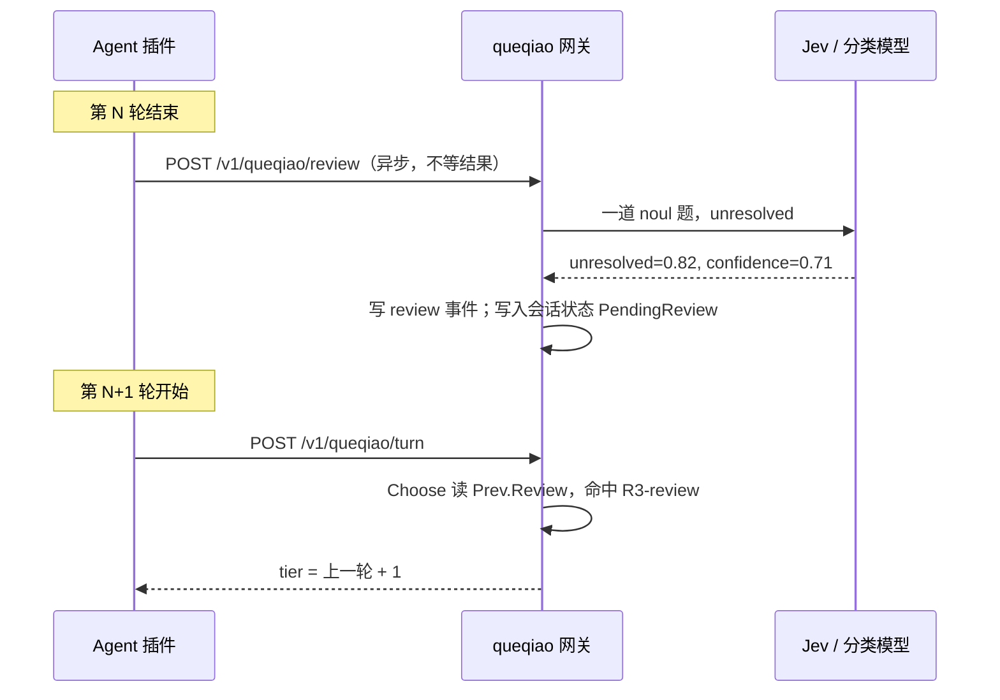

# SP7 设计：轮末复核与置信度校准

- 日期：2026-10-07
- 状态：设计已确认，待书面审阅
- 上位规格：[`2026-10-02-queqiao-design.md`](2026-10-02-queqiao-design.md)（下称“总体规格”）。本文只写 SP7 新增与改动的部分，未提到的一律沿用总体规格。
- 对标：OpenRouter《Confidence Thresholds for Model Escalation Routing》（附件“开关二”）

## 1. 为什么有 SP7

总体规格把附件的两个开关分别落成了 G1（事前选档）和 G3（事后复核），但 G3 只用了两路结果信号，用户说上一轮不对（`dissatisfied`），以及上一轮工具失败过半。OpenRouter 原文的做法，便宜模型作答时同时自报置信度、低于阈值换强模型重答，被总体规格 §1.3 整体列为非目标。

2026-10-07 重新对照原文后，结论分成三块。

1. **原样做仍然不合适**。原文只覆盖单次、一问一答的调用，明确没有讨论流式、工具调用和多步 agent。编码 Agent 的主请求是流式的、带工具的；要求生成模型输出 `{answer, confidence}` 会改掉 Agent 期待的返回格式；同一轮让强模型重答会重放写文件、跑命令这些副作用。
2. **出内容和打分可以拆开**。TypeSafe Jev 只回答 Choice/Score/Noul 这类决策题，不生成文本，输入 $0.042/百万 token、输出免费、上下文 64k，是最便宜的置信度来源。让 Jev 在一轮结束后读“用户要什么、这一档交出了什么”，回答一道带置信度的判断题，就得到了开关二要的分数，又完全不碰 Agent 的请求。这就是本文的 **轮末复核**。
3. **原文的校准纪律 queqiao 一条都没做**。原文强调自报分数没有校准、只能排序，阈值要从自己的数据里量出来，按任务类型分开配，上线后盯分数分布、升级比例、未升级部分的错误率。queqiao 已经在用 `tier_min=0.4`、`dissatisfied_min=0.7` 两个阈值做决策，都是拍的，而且 `router.jsonl` 没记全分数（`dissatisfied` 完全没记，档位置信度为 0 时被 `omitempty` 丢掉，分类器原始档位被 R4/R6 改写后看不到），想校准也没有数据。用普通模型当分类器时，置信度只有 1 或 0（`classify.go` 按回答格式是否合法记分），`tier_min` 对它形同虚设。

## 2. 目标、成功标准与非目标

### 2.1 目标

| 编号 | 目标 |
| --- | --- |
| G7.1 | **轮末复核**：主会话每轮结束后，用一道带置信度的判断题评估这一轮是否解决了用户的请求；判为没解决时，下一轮升档（新增规则来源 `R3-review`）。复核异步执行，不增加选档延迟 |
| G7.2 | **分数记全**：档位置信度、不满分数、复核分数、分类器原始档位、给分的分类器，每轮都写进 `router.jsonl` |
| G7.3 | **普通模型分类器给出真实置信度**：用结构化输出要分数，让 `tier_min` 对非 Jev 分类器生效 |
| G7.4 | **校准**：`queqiao router calibrate` 按分数段给出占比和“选低了”的比率，在错误率拐点处给出建议阈值 |
| G7.5 | **分组阈值与监控**：三个阈值可按 harness、主/子代理分别覆盖；`router report` 增加分数分布、各来源升档率、未升档轮次的选低率 |

### 2.2 成功标准

1. 复核开启（`review.mode` 为 `shadow` 或 `act`）后，三个 harness 里**符合复核条件**（§3.2）的主会话轮次，≥ 90% 在 `router.jsonl` 里有对应的 `review` 事件。
2. 开启复核前后，`POST /v1/queqiao/turn` 的 p95 延迟差不超过 50 毫秒（复核不在选档路径上）。
3. `act` 模式下，复核判为没解决且置信度达标的下一轮，决策为 `R3-review`；Codex 会话在没有工具统计的情况下也能因复核升档。
4. 在一份合成的 `router.jsonl` 上，`router calibrate` 的分段统计和建议阈值与手算一致；每段样本少于 30 时标“样本不足”，不给建议。
5. `router report` 输出 §6 列出的三项监控。

### 2.3 非目标

| 不做 | 原因 |
| --- | --- |
| 生成模型自报置信度（OpenRouter 原样） | 见 §1 第 1 条。分数改由 Jev 在轮末给 |
| 同一轮内让强档自动重答 | 副作用不可重放。只读的 `fast` 档问答轮次理论上可以，但三个 Agent 的插件能否在轮末自动重新提交一轮未经验证，列入 §9 后续，需先做 spike |
| 网关对外的“置信度升级路由组” | queqiao 定位是编码 Agent 的路由器，目前没有单次、非流式、无工具的调用方 |
| 分类器级联 | Jev 已是最便宜的置信度来源，在它后面再问更贵的生成模型，既更贵也拿不到更好的置信度 |
| 人工标注导入 | 校准用自动信号做标签（§5.2）。需要人工判对错时，`calibrate --csv` 导出后自行处理 |
| 自动改阈值 | `calibrate` 只给建议，阈值由用户改 `router.json` |

## 3. 轮末复核（G7.1）

### 3.1 数据流



插件在轮末发出请求后立即返回，不等结果。网关收到后在后台调分类器，超时上限 `review.timeout_ms`（默认 5000）。下一轮的 `/turn` 只读已经写好的复核结果，不等在途的复核；复核晚到时这一轮当作没有复核，与总体规格 §5.8 处理在途 `/turn` 的方式一致。

### 3.2 复核条件

只有同时满足以下条件的轮次才发复核，其余轮次插件不发，网关收到也直接丢弃并返回 `204`。

- 主会话轮次（`agent=main`），子代理和网关模式不复核。
- 这一轮的档位低于 `performance`。最高档复核出没解决也无处可升。
- 这一轮没有被用户中断（Claude Code `isAborted=false`）。
- 这一轮不是用户手动钉档后的轮次（会话已有 `manual_model_switch` 则整个会话不再复核）。
- 实验 `control` 组的会话不复核，避免两组受到不同的升档影响。
- `review.mode` 不为 `off`。

### 3.3 HTTP 接口

**`POST /v1/queqiao/review`**

```json
{
  "session": "string，必填",
  "harness": "claude-code | codex | pi",
  "turn_id": "string，可选",
  "prompt": "string，必填，本轮用户原话",
  "answer": "string，必填，本轮最终回复",
  "tool_calls": "int，可选",
  "tool_failures": "int，可选"
}
```

- 返回 `202`，复核在后台进行。缺必填字段返回 `400`；不符合 §3.2 的返回 `204`。
- `prompt` 与 `answer` 在网关里截断。`prompt` 沿用总体规格 §5.3 的规则；`answer` 超过 `review.max_answer_chars`（默认 6000）时保留前 2000 字和后 4000 字。
- 访问控制沿用总体规格 §6.4，只接受本机请求或带网关密钥的请求。

### 3.4 分类器的问法

用 Jev 时一次请求一道题。

```json
{
  "model": "jev-latest",
  "state": {
    "request": "<截断后的用户原话>",
    "answer": "<截断后的最终回复>",
    "tool_calls": 7,
    "tool_failures": 1,
    "tier": "fast"
  },
  "questions": {
    "unresolved": {
      "type": "noul",
      "instructions": "`request` is what a user asked a coding assistant and `answer` is the assistant's final reply for that turn. The answer leaves the request unresolved: it is wrong, incomplete, gives up, asks the user to do the work, or does something other than what was asked."
    }
  }
}
```

工具统计只作为上下文，失败比例的数值判断仍然只在 R3 的代码里做（总体规格 §5.2）。

不用 Jev 时，复核走 §4 的结构化输出，schema 为 `{unresolved: number, confidence: number}`。

结果记为 `ReviewVerdict{Unresolved, Confidence float64}`，写进会话状态的 `PendingReview`（附带 `turn_id` 和时间），并写一条 `review` 事件。

### 3.5 策略改动

`PolicyInput` 新增：

```go
Review *ReviewVerdict // 上一轮的复核结果；nil 表示没有复核、复核失败或还没回来
```

总体规格 §5.2 的 R3 增加第三个触发条件，其余规则不变：

| 规则 | 条件 | 结果 |
| --- | --- | --- |
| R3 升档 | `Prev != nil`，且下列任一：(a) `Classified.Dissatisfied ≥ DissatisfiedMin`；(b) 上一轮 `ToolCalls ≥ 3` 且 `ToolFailures*2 ≥ ToolCalls`；(c) **`review.mode == act` 且 `Review.Unresolved ≥ ReviewMin` 且 `Review.Confidence ≥ ReviewConfMin`** | 同原规则。`Reason` 按命中的第一个条件记为 `R3-escalate`（a）、`R3-tools`（b）、`R3-review`（c） |

- `ReviewMin` 默认 0.7，`ReviewConfMin` 默认 0.5，两者都可校准（§5）。
- `shadow` 模式下 (c) 不参与决策，但 `Choose` 仍计算它是否会命中，结果写进 `decide` 事件的 `would_review` 字段，供校准使用。
- 原规则 (b) 的 Reason 目前也记为 `R3-escalate`，本次拆成 `R3-tools`，以便分来源统计升档率。`router report` 与已有测试中对 `R3-escalate` 的引用一并核对。
- `PendingReview` 被一次 `Choose` 读取后清空，同一个复核结果只作用一次。

### 3.6 三个 harness 的接入

| Harness | 轮末事件 | 取最终回复 | 状态 |
| --- | --- | --- | --- |
| Claude Code（mod） | `turn.complete` | 事件字段 `answer`（已在 `register.test.ts` 中使用） | 已知可用 |
| Pi（扩展） | 轮末事件（预计为 `agent_end`） | 事件携带的最后一条 assistant 消息 | 待 S14 确认 |
| Codex（hook） | `Stop` hook，新增 `queqiao hook stop` | hook 输入中的最后一条 assistant 消息字段 | 待 S15 确认 |

插件侧的发送一律“发出即返回”：Claude Code mod 不 `await` 结果；Pi 扩展不阻塞 `agent_end`；Codex 的 `queqiao hook stop` 发出请求后立即退出，`timeout` 设为 2 秒，失败静默。

## 4. 结构化输出的分类器（G7.3）

`classify.go` 中普通模型的路径（`classifier` 不是 `typesafe/*` 时）改为一次请求要完全部分数。

```json
{
  "response_format": {
    "type": "json_schema",
    "json_schema": {
      "name": "tier_verdict",
      "strict": true,
      "schema": {
        "type": "object",
        "properties": {
          "tier": { "type": "string", "enum": ["fast", "balanced", "performance"] },
          "confidence": { "type": "number", "description": "How sure you are about the tier, from 0 (a guess) to 1 (certain)." },
          "dissatisfied": { "type": "number", "description": "How likely the message says the previous answer was wrong, from 0 to 1. Use 0 when there is no previous answer." }
        },
        "required": ["tier", "confidence", "dissatisfied"],
        "additionalProperties": false
      }
    }
  }
}
```

- 数值范围写在 `description` 里，不用 `minimum`/`maximum`，原因同 OpenRouter 原文，部分厂商的结构化输出不支持这两个约束。
- 网关自己校验返回的 JSON，越界值截到 [0,1]，`tier` 不在枚举里视为解析失败。
- 请求经 magpie 网关发往该模型的厂商。厂商不接受 `response_format`、返回 4xx，或连续解析失败时，本次退回现有的“只回编号”提示词，并在进程内记住该模型不支持结构化输出（重启后重新尝试）。退回路径的置信度仍为 1/0，`decide` 事件的 `classifier` 字段标为 `<model>#plain`，校准时可以把它们分开。
- `max_tokens` 保持 400（总体规格 §5.4 的实测修订）。
- 复核在普通模型路径下用同样的写法，schema 为 `{unresolved, confidence}`。

## 5. 记全分数与校准（G7.2、G7.4）

### 5.1 事件字段

`Event` 新增字段，均不加 `omitempty`（0 是有效分数），只在 `decide`、`shadow`、`review` 事件里写。

| 字段 | 含义 | 出现在 |
| --- | --- | --- |
| `turn_id` | harness 的轮次 ID，没有时由网关生成 | 三种事件 |
| `classified_tier` | 分类器原始给出的档位，策略改写前 | decide、shadow |
| `tier_confidence` | 档位置信度；分类失败时为 `null` | decide、shadow |
| `dissatisfied` | 不满分数；第一轮或分类失败时为 `null` | decide、shadow |
| `would_review` | `shadow` 复核模式下 (c) 是否会命中 | decide |
| `unresolved`、`review_confidence` | 复核结果 | review |
| `classifier` | 给分的模型，如 `typesafe/jev-latest`、`deepseek/deepseek-v4-flash#plain` | 三种事件 |

现有的 `confidence` 字段保留，含义不变，避免破坏已有报表。

### 5.2 校准标签

校准需要知道一轮“是不是选低了”。没有人工标注，用下列自动信号，发生在**同一会话的下一轮**即视为第 N 轮选低了：

- 下一轮的不满分数 ≥ 0.5（标签与阈值无关，取固定值，避免循环）；
- 下一轮开始前出现 `manual_model_switch`，且切到的档位高于第 N 轮；
- 第 N 轮工具调用 ≥ 3 且失败过半。

每个分数用不依赖它自己的标签校准：

| 被校准的分数 | 样本 | 标签 |
| --- | --- | --- |
| `tier_confidence` | 主会话、`classified_tier` 被采用的轮次 | 上表三项任一 |
| `dissatisfied` | 主会话第 2 轮起 | 下一轮出现 `manual_model_switch` 到更高档，或这一轮 R3 升档后下一轮仍不满 |
| `unresolved` | 有 `review` 事件的轮次 | 上表前两项（不用工具统计，复核本身读过它） |

这些标签有偏，它们只能看到用户表达出来的不满。报表在输出顶部说明这一点。需要更准的判断时，`calibrate --csv` 导出逐轮明细，自行人工判对错。

### 5.3 `queqiao router calibrate`

```
queqiao router calibrate [--since 14d] [--score tier|dissatisfied|review] [--harness <h>] [--agent main|sub] [--csv]
```

- 默认三个分数都输出，各一张表，分段与 OpenRouter 原文一致：`0.95–1.00`、`0.85–0.95`、`0.70–0.85`、`0.50–0.70`、`< 0.50`。`dissatisfied` 与 `unresolved` 越高越该升档，表头注明方向。
- 每段列出样本数、占比、选低率。
- **建议阈值**：对“越低越该升档”的档位置信度，从高分段往低分段走，第一个选低率既达到其上方各段合计选低率的 2 倍、又至少高出 10 个百分点的分段，其上界就是建议阈值；对“越高越该升档”的不满分数和复核分数，方向相反，取下界。用 OpenRouter 原文的示意数据，这条规则给出的正是原文的 0.7。任何一段样本少于 30 时，该分数不给建议，标“样本不足”。
- 同时输出当前阈值下的“升档比例”和“未升档轮次的选低率”，并给出阈值改为建议值后这两个数的估算，让用户看到原文所说的取舍。
- `--csv` 输出逐轮明细（会话、轮次、harness、agent、三项分数、标签），不含用户原话和回复。

## 6. 分组阈值与监控（G7.5）

### 6.1 配置

`router.json` 的 `thresholds` 扩展为：

```json
"thresholds": {
  "tier_min": 0.4,
  "dissatisfied_min": 0.7,
  "review_min": 0.7,
  "review_confidence_min": 0.5,
  "overrides": [
    { "harness": "codex", "agent": "main", "review_min": 0.6 },
    { "agent": "sub", "tier_min": 0.5 }
  ]
},
"review": { "mode": "off", "timeout_ms": 5000, "max_answer_chars": 6000 }
```

- `overrides` 按顺序匹配，`harness` 与 `agent`（`main` / `sub` / `gateway`）都写了的条目优先于只写一项的；只覆盖写了的字段。
- `review.mode` 取 `off`（默认）、`shadow`、`act`。默认关闭，因为复核会把 Agent 的回复发给分类器所在的厂商（Jev 即 TypeSafe），与总体规格中用户原话发给 Jev 的考虑相同，由用户自己决定。建议先开 `shadow` 跑一段时间，用 `calibrate` 定好 `review_min` 再切 `act`。
- `router init` 写入上述默认值；旧配置缺这些字段时按默认值补齐，不报错。
- 项目级 `.queqiao/router.json` 仍只允许覆盖 `criteria`（总体规格 §6.2）。

### 6.2 `router report` 新增三项

每个实验组各一份：

1. **分数分布**：三项分数按 §5.3 的五个分段列占比。
2. **升档率**：按来源分列 `R3-escalate`、`R3-tools`、`R3-review` 占主会话轮次的比例；`shadow` 模式下另列 `would_review` 的比例。
3. **未升档轮次的选低率**：按 §5.2 的标签计算。这是 OpenRouter 原文说的最要紧的一个数，它下降说明升档在起作用，它上升说明阈值需要重新校准。

## 7. 改动范围

| 位置 | 改动 |
| --- | --- |
| `internal/router/review.go`（新） | `/review` 处理、复核条件判断、后台调用、`PendingReview` 读写 |
| `internal/router/classify.go` | 结构化输出路径、退回逻辑、复核题 |
| `internal/router/policy.go` | `PolicyInput.Review`、R3 第三条件、Reason 拆分、`would_review` |
| `internal/router/session.go` | `TurnState` 旁存 `PendingReview`、会话是否已手动钉档 |
| `internal/router/config.go` | `thresholds` 新字段与 `overrides`、`review` 段、默认值与校验 |
| `internal/router/events.go` | §5.1 新字段 |
| `internal/router/calibrate.go`（新） | §5.2 标签与 §5.3 统计，纯函数，输入事件切片 |
| `internal/router/report.go` | §6.2 三项监控 |
| `internal/router/api.go` | 注册 `/v1/queqiao/review`；decide 事件写新字段 |
| `router_cli.go` | `router calibrate` 子命令；`router init` 写新默认值；`router status` 显示 `review.mode` |
| `internal/harness/` | `queqiao hook stop` |
| `clients/claude-code/hooks/register.ts` | `turn.complete` 发复核 |
| `clients/pi/extensions/queqiao.ts` | 轮末事件发复核 |
| `clients/codex/hooks/hooks.json` | 新增 `Stop` hook |

不改动任何上游文件，总体规格 §6.3 的两处挂钩之外没有新挂钩。

## 8. 先行验证（SP7 开工前完成）

延续总体规格 §10 的编号。

| 编号 | 要确认的事 | 方法 | 不成立时 |
| --- | --- | --- | --- |
| S14 | Pi 的轮末事件名和事件里能否拿到最后一条 assistant 消息文本 | 读 Pi 当前版本的扩展 API 文档与类型定义，写一个只打印事件的扩展跑一轮 | Pi 不接复核，表 §3.6 标为不支持 |
| S15 | Codex 当前版本 `Stop` hook 的输入里是否有最后一条 assistant 消息；`Stop` hook 的输出能否为空、超时如何计 | 读 Codex hooks 文档，装一个只打印 stdin 的 `Stop` hook 跑一轮 | 退而读 hook 输入里的 transcript 路径取最后一条消息；仍拿不到则 Codex 不接复核 |
| S16 | Jev 对（请求，回复）这类输入的时延和分数分布是否可用 | 用 20 组真实轮次（10 组明显解决、10 组明显没解决）各问 3 次 | 分数分不开两组时，复核只保留 `shadow` 模式，§2.2 第 3 条不作为完成标准 |
| S17 | 常用普通分类模型（DeepSeek flash、Kimi、GLM flash）是否接受 §4 的 `json_schema` | 每个模型发一次，看是否返回合法 JSON | 不支持的模型走退回路径，记录在本文 |

结论写进 `docs/superpowers/notes/spike-results.md` 的 SP7 一节。

## 9. 后续（不在 SP7）

- **只读 fast 轮次的自动重答**：复核判为没解决、且这一轮没有任何写文件或执行命令的工具调用时，由插件在下一档自动重答一次。需要先验证三个 Agent 的插件能否在轮末重新提交一轮，以及用户是否接受“自己没说话 Agent 又答了一遍”。
- 用 `calibrate --csv` 的人工判定结果反向检查 §5.2 的自动标签有多准。

## 10. 测试

| 层级 | 内容 |
| --- | --- |
| 单元 | `Choose` 的 R3 三个条件各自命中与优先顺序、`shadow` 不改档但写 `would_review`、`PendingReview` 只作用一次、`overrides` 匹配顺序 |
| 单元 | `calibrate` 在合成事件上的分段、标签、建议阈值、样本不足判定；标签不使用被校准分数本身 |
| 单元 | 结构化输出解析：合法、越界截断、枚举外、非 JSON、厂商 4xx 后退回并记住 |
| 网关集成 | `/review` 返回 202/204/400；复核在后台完成后下一轮 `/turn` 命中 `R3-review`；复核未返回时下一轮不等待（用一个故意慢的假分类器断言 `/turn` 延迟） |
| 网关集成 | 开启复核后 `/turn` 的延迟与关闭时相比不变（同一假分类器，比较 p95） |
| 插件 | Claude Code：`claude plugin test` 断言 `turn.complete` 发出复核且不等待；被中断的轮次和 `performance` 轮次不发。Pi：vitest 同样断言。Codex：`queqiao hook stop` 的集成测试，网关不在时静默退出 |
| 真机 | 三个 Agent 各跑一轮故意答不好的请求（如要求读一个不存在的文件并总结），`shadow` 模式下看到 `review` 事件，`act` 模式下下一轮为 `R3-review` |

所有 Go 测试按总体规格的约定运行 `go test -tags nogui ./...`；按 LESSONS.md，判断为不稳定之前先跑 `-race -count=20`。

## 11. 对总体规格的改动

随本文一起提交：

- §1.1 G3 的描述补一句“SP7 起增加轮末复核信号（见 SP7 规格）”。
- §1.3 第一行的理由改为：生成模型自报置信度在 Agent 主请求上不可行（流式、工具调用、改变返回格式、副作用不可重放），分数改由 Jev 在轮末给出，见 SP7。
- §5.2 的 R3 行注明 SP7 增加条件 (c) 与 Reason 拆分。
- §11 的子项目表增加 `SP7-review`，依赖 SP2–SP6 全部完成；执行顺序在 SP5 之后。

## 执行结果（2026-10-07 完成）

**产出**：PR [#19](https://github.com/weiping/queqiao/pull/19)（15 个提交，`qq/sp7-review` → `queqiao`），merge commit `8f774d71`；CI 三平台全绿（macos 18m55s / ubuntu 16m14s / windows 2m58s + Socket Security）。发布 `qq-v0.1.4`（16 资产）、Pi 扩展 `@weiping/pi-queqiao@0.1.2`、两个插件清单 0.1.1。

**实现**（逐任务 TDD，每任务一次提交）：

- **Task 0 spike**：S14 Pi `agent_end` 成立；S15 Codex `Stop` 成立；S16 Jev 复核可分离（解决组 0.26 vs 未解决组 0.95，差 0.690 ≥ 0.3，p50 361ms）；S17 部分——Kimi 合法 JSON，**DeepSeek 明确 400**（退回路径因此必需），GLM 配额用尽未测。
- **Task 1–4**：`review` / `thresholds.overrides` / `review_*` 阈值；R3 三来源 `R3-escalate` > `R3-tools` > `R3-review`；事件记全分数（指针语义：真 0 写出、读不到省略）；普通模型结构化输出 + `#plain` 退回标记。
- **Task 5**：`POST /v1/queqiao/review`（202/204/400）、后台复核、晚到丢弃、只读一次、钉档会话跳过；`-race` 干净。
- **Task 6–7**：`queqiao router calibrate`（五段、2×/+0.10 双条件、样本 <30 标不足、`--csv`）与报表的升档来源 / 未升档选低率。
- **Task 8–10**：三个 harness 的轮末发包（Claude Code `turn.complete`、Pi `agent_end`、Codex `Stop` hook），全部 fire-and-forget。

**验证**：`claude plugin test` 26 pass、`npx vitest run` 30 pass、Go 全量仅插件宿主用例红（本分支对 `internal/plugin`、`internal/gui`、`host.js` 零 diff，且该用例在干净 `origin/queqiao` 上同样失败 → 环境性）。

**真机验收**（SP7 二进制服务用户真实配置，三 Agent 各一轮）：Claude Code ✅（`decide` 记全分数 + `review` 事件带真实 `turn_id`；shadow 下 `would_review:true` 不升档；act 下 `R3-review`、fast→balanced、`unresolved:0.97`）；Pi ✅（`harness:pi`、`unresolved:0.66` → 不升档）；Codex ⚠️（`codex exec` 下 `Stop` 执行但 `UserPromptSubmit` 未产出状态文件 → 不发复核；手动按真实 payload 串起则产出 `harness:codex`、`unresolved:0.96` 的 `review` 事件）。

**设计上值得记住的一条**：Jev 冷启动可能超过 `classify_timeout_ms`(1500)，那一轮落 `R8-default`——它不是错误，但首个请求的复核会缺失（热机后 <400ms）。

**执行中的偏离**（完整清单见执行台账 `.superpowers/sdd/2026-10-07-queqiao-sp7-review/progress.md`）：

1. S17 的模型 id 在本机不存在 → 改用本机等价模型；GLM 配额待复测。
2. §5.3 要求「report_test 增加一条：`R3-tools`/`R3-review` 与 `R3-escalate` 的档位分布相同」——实测 `report.go` 不读 `Reason`，该断言空虚；以「更新两处既有断言 + grep 确认无生产代码依赖旧 reason」代之，按来源的统计留给 Task 7。
3. Task 4 之后三个既有 plain 分类测试会回归（schema 优先）→ 让它们的假 ask 对 `response_format` 返回错误，即「厂商拒绝」这一现实情形。
4. Task 5 的测试日志闭包在后台复核 goroutine 下有 data race（生产 `Append` 有锁）→ 测试改用带锁记录器。
5. Task 10 计划提到「hooks.json 通过现有 Schema 校验」，但仓库内没有该 schema → 改为解析 JSON 断言 Stop 的 type/command/timeout；并加了计划未要求的 `turn_id` 错配守卫。
